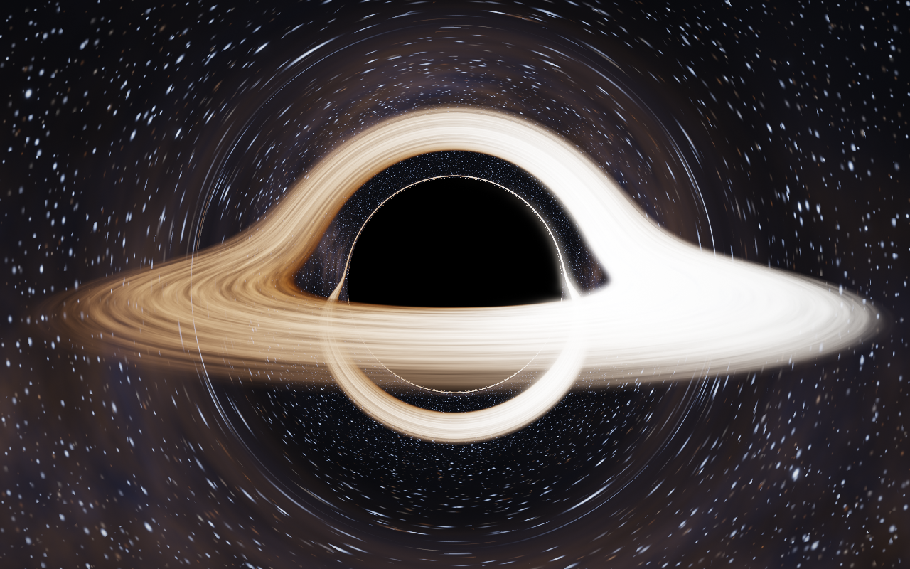
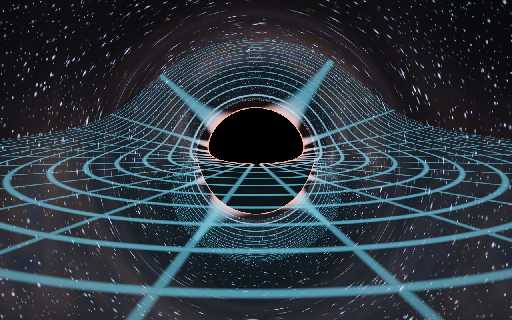
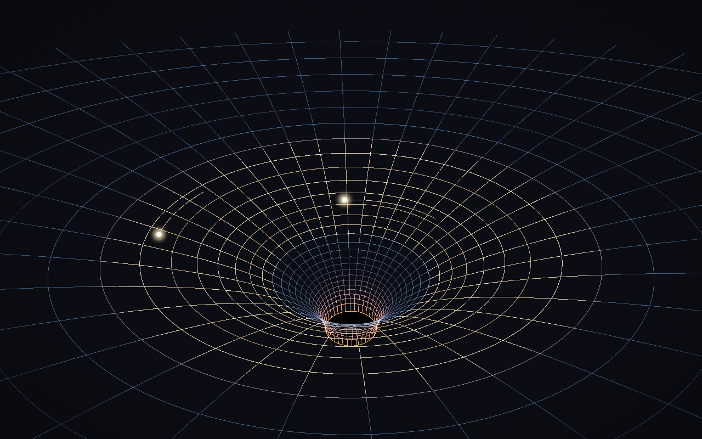

# Event Horizon Laboratory — C++ / WebAssembly / WebGPU

The repository now includes a browser laboratory in `web/` and a compiled
deployment in `public/`. It starts with a clean Schwarzschild black hole—no
accretion disk—and lets an observer inject planets, stars, neutron stars, and
other black holes. Pressing **Inject into spacetime** opens a viewport reticle;
the next click chooses the physical aim point. Mass, radius, composition,
release distance, launch speed, tangential bias, central mass, and time rate
are adjustable.

The browser architecture is deliberately split:

- `web/sim.cpp` is the C++17 WebAssembly dynamics core. It works in geometric
  units, combines a pseudo-relativistic primary field with pairwise N-body
  companion gravity in the accelerating primary frame, evolves tidal stretching
  and stream circularization, handles physical-radius capture and black-hole
  mergers, and supplies physical telemetry.
- `web/app.js` owns the WebGPU null-geodesic tracer. Each pixel integrates the
  Schwarzschild photon equation; the shadow, photon ring, lensing, and any disk
  created by disrupted matter share the same bent rays. Spawned bodies and their
  finite-width debris streams are resolved against the nearest primary ray.
- Pilot mode uses an inertial velocity vector, the local Schwarzschild circular
  speed, engine impulses, gravitational acceleration, and a proper-time HUD.

Build and serve the browser edition:

```sh
npm run build
npm start
# http://127.0.0.1:8342
```

The build script uses the Emscripten SDK at
`/Users/sshpro/emsdk/upstream/emscripten/emcc` by default; override it with the
`EMCC` environment variable. WebGPU is preferred and a WebGL2 ray-lensing
fallback is included for browsers without WebGPU.

## Native OpenGL edition

A scientifically accurate, real-time 3D simulation of a Schwarzschild black
hole. Every pixel traces a photon backwards through curved spacetime on the
GPU, so gravitational lensing, the photon ring, the shadow, and the multiple
images of the accretion disk all emerge from the geodesic equation — nothing
is painted on.



| lensed spacetime grid (`G`) | Flamm-paraboloid trapdoor (`TAB`) |
|---|---|
|  |  |

## Build & run

Requires: macOS, CMake, and GLFW (`brew install glfw`).

```sh
cmake -B build -DCMAKE_BUILD_TYPE=Release
cmake --build build -j
./build/blackhole
```

A window opens with the simulation running in real time (OpenGL, GPU-
accelerated — on Apple Silicon this runs through Metal via Apple's GL stack).

## The physics

Geometric units `G = c = M = 1` (horizon `r_s = 2`, photon sphere `r = 3`,
ISCO `r = 6`, critical impact parameter `b_crit = 3√3 ≈ 5.196`).

**Gravitational lensing (ray tracing).** Schwarzschild spacetime is
spherically symmetric, so every null geodesic lies in a plane. Each pixel's
photon is integrated in its own orbital plane with the exact null geodesic
(Binet) equation

```
d²u/dφ² = 3u² − u ,   u = 1/r
```

using 4th-order Runge–Kutta with adaptive step (`shaders/blackhole.frag`).
Initial conditions come from the static observer's orthonormal tetrad at the
camera (`du/dφ = −u √f · cot ψ`, `b = r sin ψ / √f`, `f = 1 − 2M/r`). Rays that
spiral past `φ > 20` rad are within ~10⁻⁴ of `b_crit` and are treated as
captured. Escaping rays fetch the (procedural) starfield with their asymptotic
direction — which is how the Einstein-ring warping of the background and the
Milky-Way band arises.

**Tidal disruption.** The physical Roche/tidal radius is evaluated from each
body's mass and radius. Once it is crossed, the renderer conserves the core's
display volume while stretching it into an ellipsoid and draws continuous,
tapered leading and trailing debris arms in the instantaneous orbital plane.
The C++ core accumulates swept orbital phase and bound fraction. A direct plunge
is swallowed without inventing a disk; a disk begins only after returning debris
has wrapped far enough to self-intersect, shock, and lose orbital energy.

**Accretion disk.** A geometrically thin, optically thick disk from the ISCO
(6M) to 16M. Disk-plane crossings are found analytically per half-winding
(`z ∝ sin(φ − φ₀)`) and refined with cubic Hermite interpolation, so the
first-order image, the image of the disk's far side arched over/under the
shadow, and higher-order photon-ring images all come from the same integrator.
Radiation is fully relativistic:

- Temperature: Novikov–Thorne thin-disk profile
  `T(r) ∝ [ (1 − √(6/r)) / r³ ]^{1/4}` (peaks at `r = 49/6 ≈ 8.17M`).
- Redshift: for gas on circular Keplerian orbits (`Ω = r^{−3/2}`), a photon
  with conserved `E = 1` and axial angular momentum `L_z` has
  `g = √(1 − 3M/r) / [(1 − Ω L_z) √f_cam]` — the exact combination of
  gravitational redshift and special-relativistic Doppler.
- Beaming: bolometric intensity transforms as `I_obs = g⁴ I_em`
  (Liouville's theorem, `I_ν/ν³` invariant), which is why the approaching side
  blazes white-blue and the receding side is a dim deep orange.
- Color: Planck (blackbody) spectrum evaluated at `g·T(r)`. Real disks around
  stellar-mass black holes peak in X-rays; the temperature scale is compressed
  into the visible band for display (peak ≈ 8200 K), but all *ratios* are the
  physical ones.
- The turbulent surface pattern is advected differentially with the local
  Keplerian angular velocity, so the inner disk visibly shears past the outer.

**Halos.** The scene renders to an HDR (RGBA16F) buffer; a bright-pass +
separable-Gaussian bloom chain produces the glow/halos around the photon ring,
the disk's hot inner edge, and bright stars, then everything is ACES-tonemapped.

**Spacetime curvature — the "trapdoor".** Two visualizations:

1. **`G` — lensed coordinate grid**: rings of constant Schwarzschild `r`
   (every 2M) and radial spokes painted on the equatorial plane and ray-traced
   through curved spacetime. Color encodes the lapse `√(1 − 2M/r)` — blue
   where clocks tick normally, red where time freezes at the horizon. Near the
   shadow you can watch the grid wrap around the photon sphere infinitely
   many times: the trapdoor's rim.
2. **`TAB` — embedding (funnel) view**: Flamm's paraboloid
   `z(r) = 2√(2M(r − 2M))` — the *exact* isometric embedding of the
   equatorial slice of the Schwarzschild metric, i.e. the true shape of space
   around the hole, not an artist's trampoline. The grid plunges into the
   throat and ends at the horizon (the cap at the bottom). Two test masses
   orbit at Keplerian rates (the inner one visibly faster), and the disk's
   footprint is painted on the surface.

**Approximations** (documented for honesty): metric is Schwarzschild (no spin);
the disk pattern ignores light-travel-time delay across the image; camera is a
static observer (its small blueshift `1/√f_cam` *is* included in `g`); the
temperature scale is compressed into the visible band; stars are procedural.

## Controls

| Input | Action | Input | Action |
|---|---|---|---|
| drag | orbit camera | scroll | zoom (6.5–90 M) |
| `A` | auto-orbit | `SPACE` | pause time |
| `D` | accretion disk | `G` | lensed spacetime grid |
| `S` | background stars | `TAB`/`E` | funnel (embedding) view |
| `1`/`2`/`3` | render scale 0.5 / 1.0 / 2.0 (4× SSAA) | `-`/`=` | exposure |
| `P` | screenshot → `shots/` | `H` | help |
| `Q`/`ESC` | quit | | |

CLI: `--size WxH  --scale f  --mode ray|grid|funnel  --frames N  --shot out.png  --no-rotate`

## Performance

All physics runs in a fragment shader (one geodesic per pixel, ≤600 RK4 steps,
early exit on capture/escape/opacity), so it is fully GPU-bound. Measured on an
M4 Max: **~1.7 ms/frame (≈600 fps) at 1280×800** and **~4.4 ms (≈230 fps) at
2560×1600 with 4× supersampling** — far beyond real-time (the interactive
window is vsync-locked to your display's refresh). Bloom runs at ¼ area.
Benchmark yourself with `./build/blackhole --frames 200` (uncaps vsync,
prints the average frame time on exit).
