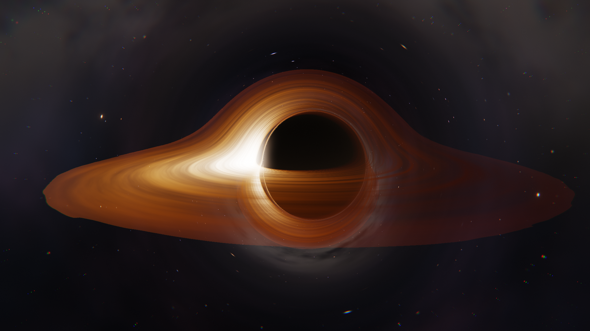

# Gargantua — Kerr black hole renderer (Vulkan on Metal, HDR)

A real-time general-relativistic renderer of a **spinning (Kerr) black hole**
with a relativistic accretion disk, written in Python. Rendering runs on the
GPU via **Vulkan → MoltenVK → Metal**, with **HDR/EDR output** on XDR
displays; all light transport is computed by integrating null geodesics in
the fragment shader.



## Physics

- Photon paths integrate Hamilton's equations for null geodesics in
  **Kerr–Schild Cartesian coordinates** (`2H = |p|² − 1 − f(1 + k·p)²`,
  E = 1, analytic gradients, adaptive RK4). Kerr–Schild is horizon-penetrating
  and regular along the spin axis, so there are no coordinate artifacts.
- Spin `a` up to 0.998: frame dragging, the D-shaped shadow, the asymmetric
  photon ring, and prograde/retrograde capture asymmetry all emerge from the
  integration — nothing is painted in.
- **Volumetric accretion disk** from the **spin-dependent prograde ISCO**
  (Bardeen: 6M at a=0 down to 1.24M at a=0.998): the two primary lensed
  images integrate emission and Beer–Lambert absorption through a flared,
  clumpy slab along the photon's chord (5 samples, lumpy local scale height,
  height-dependent internal layers, grazing-path limb thickening), with a
  Novikov–Thorne temperature profile `T(r) ∝ [r⁻³(1−√(r_in/r))]^¼` and
  Planck blackbody color.
- **Exact Kerr redshift** for the disk: `g = 1/[uᵗ(1 − Ω L_photon)]` with the
  circular-geodesic `uᵗ` — gravitational redshift, orbital time dilation, and
  Doppler in one closed form — plus bolometric g⁴ beaming.
- Every equatorial crossing of the bent ray is composited, so the lensed
  upper/lower images and higher-order rings appear physically.
- Procedural starfield, Milky Way band, and nebulae — lensed by the hole.
- HDR pipeline: f16 targets → bright pass → two-level Gaussian bloom →
  chromatic aberration → tonemap → grain/vignette.

## Performance (120 fps on ProMotion)

- The smooth sky (16 fbm octaves/direction) and the four advected disk noise
  fields (streaks, filaments, clumps, layers) are **baked once at startup** —
  sky into a 1024³ cubemap, disk noise into a wrapping 2048×2048 RGBA
  (log r, φ) texture **with a full mip chain** — so the per-frame shader does
  texture fetches instead of ~200 hash evaluations per pixel. Point stars
  stay analytic and subpixel-crisp.
- Disk noise is sampled with **explicit anisotropic LOD** (pixel footprint at
  the hit, stretched by grazing incidence; the static-camera path derives the
  true footprint — lensing magnification included — from neighbouring cache
  texels), so minification cannot moiré and magnification stays smooth.
- Hybrid integrator: RK4 near the photon shell (r < 7M), midpoint RK2 in the
  weak field, with curvature-capped adaptive steps. Disk crossings are
  detected by plane sign change and interpolated, so no small-step crawl is
  needed near the equatorial plane. Higher-order photon-ring crossings are
  softly damped to keep the ring bright without subpixel shimmer.
- Bloom blur uses a separable Gaussian collapsed from 9 taps to 5 linear
  samples per pass, preserving the same kernel shape with fewer texture
  fetches.
- **Dynamic resolution**: all presets hold the display's refresh rate
  (120 Hz on ProMotion) by trading render scale between 0.35× and the
  preset's ceiling. The controller works on the achieved frame rate (fence
  intervals saturate at the vsync period and say nothing about headroom).
  **Ultra** uses dynamic resolution only while the camera moves, snaps back
  to fixed full resolution when it settles, and then re-shades from the
  transport cache (~2 ms/frame at 2700×1526 on an M4 Pro).
- When dynamic resolution renders below the output size, the composite pass
  upsamples with a 9-tap **Catmull-Rom** filter (bilinear-optimized, MJP) —
  much sharper than plain bilinear at the same cost class; chromatic
  aberration is applied as a bilinear delta on top.

## HDR (EDR) output

On Macs with XDR displays the swapchain is `R16G16B16A16_SFLOAT` +
`VK_COLOR_SPACE_EXTENDED_SRGB_LINEAR_EXT` (via `VK_EXT_swapchain_colorspace`):
linear values where 1.0 = SDR white. The display's **live EDR headroom** is
polled from `NSScreen.maximumExtendedDynamicRangeColorComponentValue` (up to
~16× SDR white on 1600-nit XDR panels, tracking the brightness slider) and
shown in the title bar. Tonemapping is linear through the SDR range with a
C¹ rational shoulder that rolls highlights off toward the current headroom,
so the disk's hot side drives the backlight to the panel's actual peak.
Toggle at runtime with `H`; falls back to 8-bit SDR (+ ACES) when
unavailable. PNG screenshots always use the SDR path.

## Setup (macOS, Apple Silicon)

```sh
brew install molten-vk vulkan-loader shaderc
python3.13 -m venv .venv
.venv/bin/pip install numpy vulkan glfw pillow
```

## Run

```sh
./run.sh                                    # interactive, HDR if available
./run.sh --spin 0.998 --quality 4
./run.sh --sdr                              # force 8-bit SDR
./run.sh --shot out.png --size 2560x1440    # offscreen still
.venv/bin/python test_blackhole.py          # test suite (21 tests)
.venv/bin/python bench.py                   # GPU frame-time benchmark
```

The launcher re-execs Python with `DYLD_LIBRARY_PATH` so the `vulkan` cffi
binding can dlopen Homebrew's `libvulkan.dylib`; the MoltenVK ICD path is set
in-process.

## Controls

| input | action |
| --- | --- |
| drag | orbit camera |
| scroll | dolly in/out |
| `[` / `]` | spin down / up (ISCO follows) |
| `H` | toggle HDR (EDR) output |
| `SPACE` | pause disk time |
| `B` / `D` / `G` | toggle bloom / Doppler / inflow glow |
| `1`–`4` | quality presets (dynamic-resolution ceiling + 112–720 steps; `4` = full res + cached re-shade when the camera settles) |
| `S` | save screenshot PNG |
| `R` | reset camera |
| `ESC` / `Q` | quit |

## Files

- `blackhole.py` — CPU reference physics (Kerr–Schild, mirrors the GLSL),
  camera, CLI, interactive loop
- `shaders.py` — Vulkan GLSL (geodesic ray marcher + post), glslc + cache
- `vkrenderer.py` — instance/device (MoltenVK), HDR swapchain, render graph
- `test_blackhole.py` — physics vs. GR analytics (ISCO, deflection, frame
  dragging, null conservation), SPIR-V, device smoke tests
