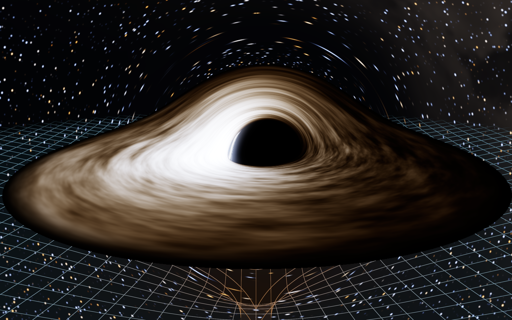
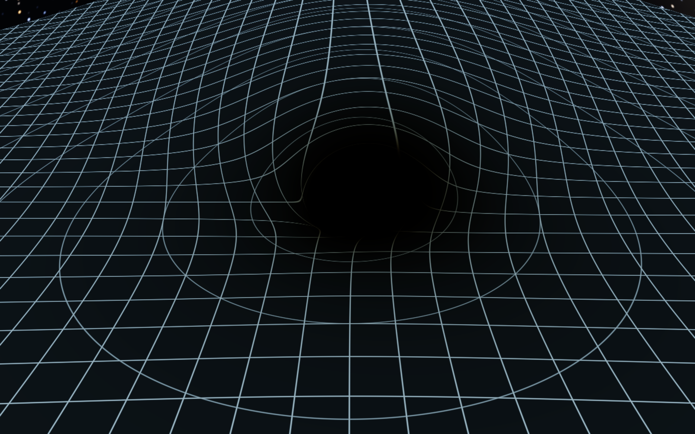
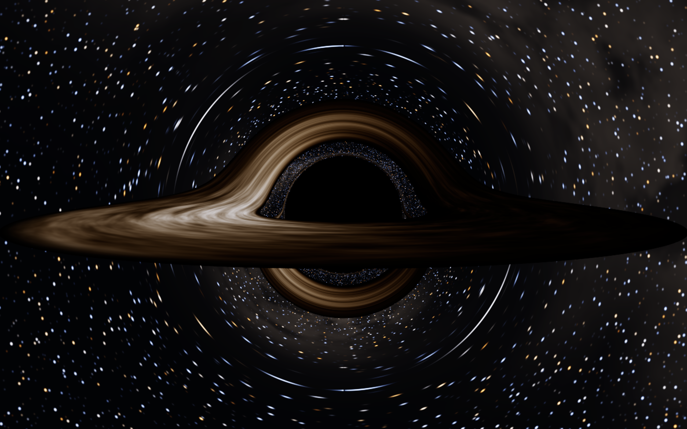
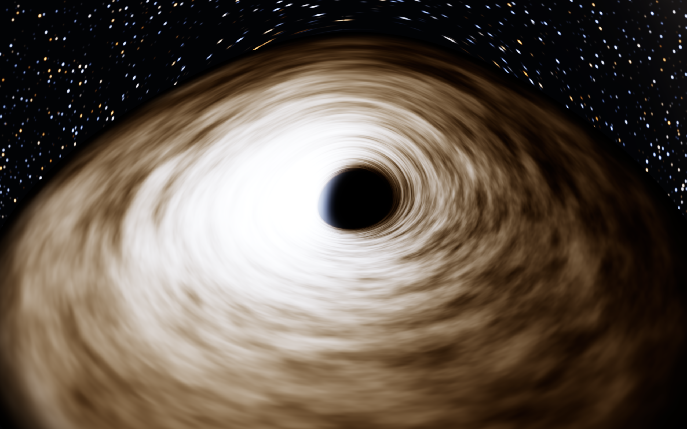

# Kerr black hole — real-time ray-traced simulation (C++ / Metal)

A physically based, real-time 3D simulation of a spinning (Kerr) black hole for
Apple Silicon Macs. Every pixel is a null geodesic integrated backwards through
the exact Kerr metric on the GPU; the accretion disk is the relativistic
Novikov–Thorne thin disk with exact Doppler + gravitational redshift; the
"trapdoor in spacetime" is shown with the exact embedding diagram of the
equatorial plane (Flamm's paraboloid generalised to Kerr) and, alternatively,
with a ray-traced (lensed) coordinate grid.

|  |  |
|---|---|
| a = 0.9, disk + embedding funnel (default view) | a = 0.9, disk off, ray-traced equatorial grid lensed around the shadow |
|  |  |
| a = 0, edge-on: primary/secondary/tertiary disk images, ISCO gap, photon ring | a = 0.998: D-shaped shadow, disk down to r = 1.24 M |

## Build & run

Requirements: macOS with Xcode command-line tools (Apple clang, Metal). Tested on
macOS 27 / M4 Max. No third-party dependencies.

```sh
cd black-hole-cpp-fable-5-1
make            # builds ./blackhole (the app) and ./verify (physics test-suite)
./blackhole     # opens a window; the simulation runs in real time
./verify        # runs the numerical verification against closed-form GR results
```

Useful flags: `--spin a` (−0.998…0.998), `--inc deg` (camera inclination from
the spin axis), `--dist r` (camera radius in M), `--scale s` (ray-traced
resolution relative to the Retina drawable, default 0.5), `--t0 K` (disk
temperature scale), `--grid 0-3`, `--no-disk`, `--no-bloom`,
`--frames N --screenshot out.png` (render N frames headless-ish and save a PNG).

### Controls (press **H** in the window)

| Input | Action |
|---|---|
| left-drag / arrow keys / I K J O | orbit the camera (inclination, azimuth) |
| right-drag, **Z** | free-look (yaw/pitch), reset look |
| scroll | zoom (camera radius 4…200 M) |
| **[** / **]** | spin a −/+ 0.05 (negative a = retrograde disk) |
| **,** / **.** | disk temperature scale T₀ ÷/× 1.15 |
| **−** / **=** | exposure |
| **D** | accretion disk on/off |
| **G** | grid mode: off → embedding funnel → lensed equatorial grid → both |
| **X** | ghost (hidden-line) rendering of the funnel behind the disk |
| **B**, **T**, **L** | bloom, disk turbulence, limb darkening on/off |
| **F** / **V** | field of view −/+ 5° |
| **P**, **Space** | pause disk motion, auto-orbit |
| **1** / **2** / **3** | ray-traced resolution 0.35× / 0.5× / 1× of the drawable |
| **S**, **R**, **Q** | screenshot (PNG in cwd), hot-reload shaders, quit |

## What is simulated, and how

Geometric units G = c = M = 1. All formulas live in `src/kerr_geodesic.h`
(shared verbatim by the Metal shaders and the CPU test-suite) and
`src/physics.hpp` (CPU, double precision).

### Spacetime and ray tracing
* **Kerr metric** in Boyer–Lindquist coordinates, arbitrary spin |a| ≤ 0.998.
* **Null geodesics** from the super-Hamiltonian H = ½ gᵘᵛ pᵤ pᵥ with the conserved
  E and L_z, integrated in Mino time with adaptive-step RK4. The Hamiltonian is
  Carter-separated, 2ΣH = Δp_r² + p_θ² − P²/Δ + (L − aE sin²θ)²/sin²θ, and the
  equations of motion are the exact analytic partial derivatives (no finite
  differences). Rays are traced *backwards* from the camera with the arriving
  photon's momentum, so frame dragging enters with the right sign.
* **Camera** = zero-angular-momentum observer (ZAMO) at (r, θ, φ) with the exact
  Bardeen tetrad; pixel directions are the photon's direction in that local
  orthonormal frame, so the image is what that observer would see.
* Rays terminate at the horizon (or when ingoing inside the innermost circular
  photon orbit), at a disk/grid intersection (sub-step + Newton refinement of
  the θ = π/2 crossing), or when escaping past r = max(120 M, 2.5 r_cam), after
  which the celestial direction is taken from the photon's momentum. The
  residual bending beyond that radius is ≲ M·b/r² ≈ 10⁻³ rad.
* Every pixel accumulates up to 8 jittered sub-pixel rays while the camera is
  still (progressive anti-aliasing of the razor-thin photon ring); the
  geodesic G-buffer is cached so the disk animates at full frame rate.

### Accretion disk
* **Novikov–Thorne / Page–Thorne (1974) thin disk**: zero torque at the ISCO,
  flux F(r) from Page & Thorne eq. 15n with the exact cubic-root coefficients,
  T(r) ∝ F¹ᐟ⁴, tabulated in double precision. Inner edge at the exact ISCO
  (Bardeen, Press & Teukolsky 1972), including retrograde disks (a < 0).
* **Kinematics**: exact circular Keplerian orbits, Ω = 1/(r³ᐟ² + a) and
  uᵗ = (r³ᐟ² + a) / (r³ᐟ⁴ √(r³ᐟ² − 3r¹ᐟ² + 2a)).
* **Redshift**: g = E_cam / E_em = 1 / [uᵗ (E − Ω L)] per ray, combining
  gravitational redshift, transverse and longitudinal Doppler shift, and
  relativistic beaming. The observed spectrum of a redshifted blackbody is
  *exactly* a blackbody at g·T, so the observed colour and brightness are read
  from one Planck → CIE XYZ → linear-sRGB table (CIE 1931 colour-matching
  functions, Wyman–Sloan–Shirley fit). No ad-hoc "Doppler colour".
* **Temperature scale**: T(r) = T₀·(8πF/3)¹ᐟ⁴ with T₀ = [3c⁶Ṁ/(8πσG²M²)]¹ᐟ⁴.
  The HUD shows T₀, the resulting peak temperature, the radiative efficiency
  η = 1 − E_isco (5.7 % at a = 0, 32 % at a = 0.998) and the accretion rate in
  Eddington units that T₀ implies for a 10⁸ M☉ hole. The default T₀ = 40 000 K
  puts the a = 0.9 disk peak at ≈ 9 000 K so Doppler shifts are visible as
  colour; a stellar-mass hole at 10 % Eddington would be ~10⁷ K (all blue-white
  in the visible band). Change it with `,` and `.`.
* **Limb darkening**: grey-atmosphere law I(μ) ∝ 1 + 2.06 μ, with μ the emission
  cosine in the fluid frame (invariant p_θ/√Σ divided by the fluid-frame energy).
* **Time-of-flight**: the G-buffer stores the coordinate-time delay of each
  ray, so the co-rotating brightness pattern is sampled at the retarded
  emission time. The far side seen lensed over the top is correctly delayed.
* **Halos**: the arcs above and below the shadow are the secondary (n = 1) and
  higher-order images of the disk; the thin bright rim hugging the shadow is
  the photon ring. They are not drawn — they fall out of the geodesics.

### Spacetime curvature ("trapdoor in spacetime")
* **Grid mode 1 — embedding diagram.** The equatorial slice t = const, θ = π/2 has
  induced metric ds² = (r²/Δ)dr² + (r² + a² + 2a²/r)dφ². It is embedded exactly
  as a surface of revolution (R(r), Z(r)) in Euclidean 3-space by integrating
  (dZ/dr)² = r²/Δ − (dR/dr)² from the sheet's rim down to the horizon (or to
  where the embedding ceases to exist for very high spin). For a = 0 this is
  Flamm's paraboloid Z = 2√(2(r − 2)) (verified to 8·10⁻⁶). The sheet is
  rasterised with the same camera and depth-composited against the ray-traced
  image; the colour runs cool → hot with depth in the well. It is a diagram of
  the spatial geometry and is deliberately *not* lensed.
* **Grid mode 2 — lensed coordinate grid.** A luminous coordinate grid painted
  on the equatorial plane is ray-traced as a physical object: its lines wrap
  around the shadow, multiply-imaged, and dim/redden toward the horizon by the
  exact ZAMO redshift g = α/(E − ωL). Turn the disk off (**D**) to see it whole.

### Sky
Procedural star field (blackbody-coloured stars, 2 600–35 000 K, on a cube-map
lattice) and a diffuse galactic band. Both are looked up in the lensed
direction, with the camera's gravitational blueshift 1/E applied as a
temperature shift (and g⁴ for the diffuse surface brightness).

### Deliberate non-physical elements
The turbulent brightness pattern (multiplicative noise frozen into the
Keplerian flow), the soft outer truncation of the disk at 24 M, the optional
bloom (camera glare), and the fact that the embedding funnel is an overlay.
Everything else follows from the metric.

## Verification (`./verify`)

The same integrator code the GPU runs is compiled on the CPU in double and float
and checked against closed-form GR results. All checks pass:

| Test | Result |
|---|---|
| Schwarzschild critical impact parameter b_c = 3√3 M | 5.1961523 vs 5.1961524 (err 1.6·10⁻⁷) |
| Kerr shadow edges vs Bardeen (1973) critical ξ, a = 0.5 / 0.9 / 0.998, prograde & retrograde | all within 3·10⁻⁷ |
| Off-equator shadow boundary vs Bardeen's (ξ, η) curve, a = 0.9, ±1.5 % | 12/12 probes captured/escaped correctly |
| Weak-field deflection vs 4/b + 15π/4b² + 128/3b³ (b = 50, 100, 200) | err 2.9·10⁻⁵, 1.2·10⁻⁶, 7·10⁻⁷ rad |
| Null-constraint drift H = 0 along a ray looping the a = 0.9 photon shell | 7·10⁻⁸ relative |
| Face-on disk redshift, Schwarzschild: g·E = √(1 − 3/r) | exact to 10⁻¹⁶ |
| ISCO radii satisfy r² − 6r + 8a√r − 3a² = 0 for a = ±0.9, 0.998, 0.5 | residual ≤ 10⁻¹⁴ |
| Page–Thorne flux: F(r_isco) = 0, F → 3Ṁ/(8πr³) far out | 0, ratio 0.99 at r = 10⁵ |
| Radiative efficiency η(0) = 1 − √(8/9), η(0.998) = 0.321 | exact / 6·10⁻⁶ |
| Embedding vs Flamm's paraboloid (a = 0, 200 samples) | max error 7.7·10⁻⁶ |
| float32 (GPU path) vs double, 4096 rays, a = 0.9, disk on | 100 % hit-type agreement, Δr ≤ 8·10⁻⁵, Δg ≤ 2·10⁻⁶, sky direction ≤ 5·10⁻⁴ rad |

## Performance (M4 Max, 2560×1600 Retina window)

Ray tracing runs at half the drawable resolution (1280×800) by default:
one geodesic pass ≈ 10–25 ms (≈ 40–100 fps while orbiting), then 8 jittered
passes converge the anti-aliasing, after which only the shading pass runs
(≈ 5 ms). Press **3** for full-resolution tracing, **1** for a faster preview.
Mean cost is ≈ 45 RK4 steps per ray thanks to the scale-aware step control.

## Files

```
Makefile
src/kerr_geodesic.h     Kerr Hamiltonian, RK4 integrator, camera tetrad, ray tracer (MSL + C++)
src/physics.hpp         horizons, ISCO, photon orbits, Page–Thorne flux, embedding, colorimetry
src/shader_types.h      uniform layouts shared with the shaders
src/shaders/kerr.metal  trace kernel, shading (disk/grid/sky), bloom, tone-map blit, funnel mesh
src/renderer.mm         Metal pipelines, progressive G-buffer, HUD, screenshots
src/main.mm             Cocoa window, input
src/verify.cpp          verification suite (make verify && ./verify)
screenshots/            reference renders
```

References: Bardeen (1973) shadow & photon orbits; Bardeen, Press & Teukolsky
(1972) circular orbits and ISCO; Page & Thorne (1974) thin-disk flux; Carter
(1968) separated Hamiltonian; Flamm (1916) embedding; Wyman, Sloan & Shirley
(2013) CMF fit; Luminet (1979) for the classic edge-on image.
