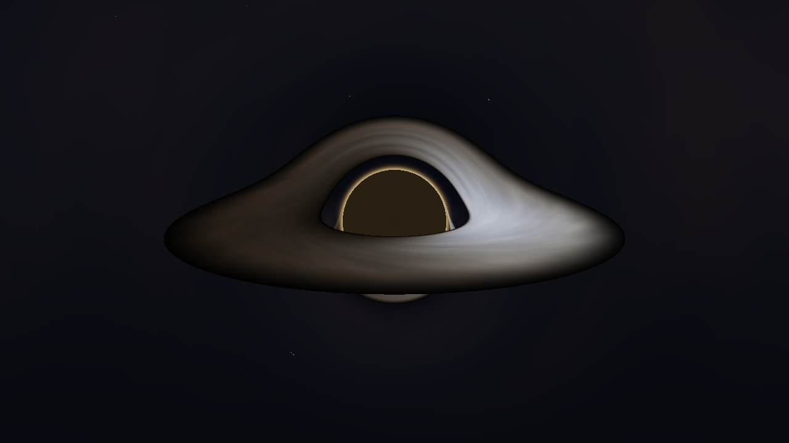
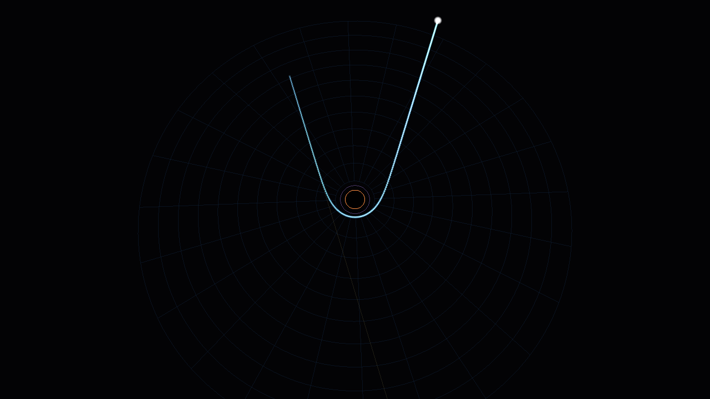
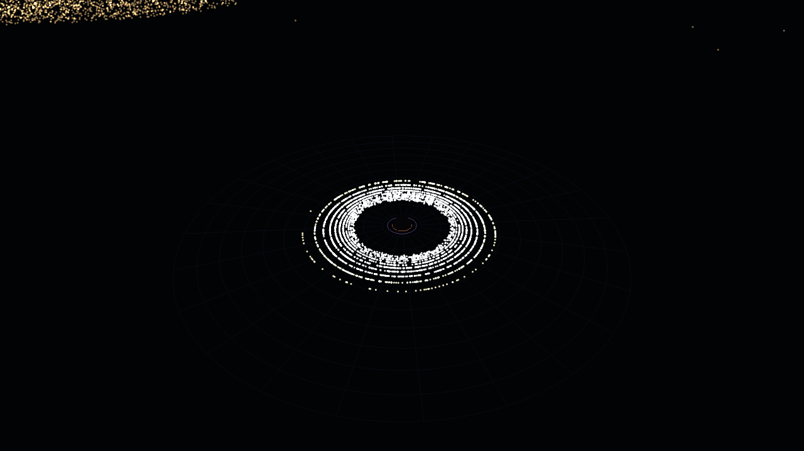
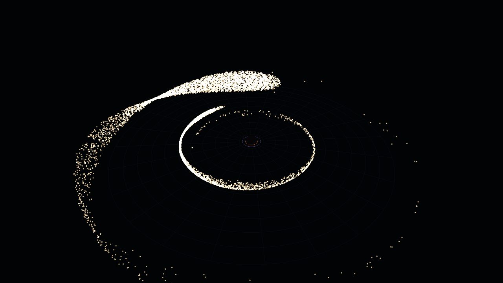

# Black Hole — a real-time, physically-based Schwarzschild simulator (C++/OpenGL)

A from-scratch GPU black-hole renderer for macOS (Apple Silicon). Every pixel
of the main view is produced by **integrating a light ray through curved
spacetime**, so gravitational lensing, the photon ring, the shadow, and the
warped "halo" images of the accretion disk all emerge from the physics rather
than being faked.



There are four views (cycle with **TAB**, or keys **1 / 2 / 3 / 4**):

| Mode 1 — Relativistic Ray-Trace | Mode 2 — Spacetime Curvature | Mode 3 — Light-Ray Bending | Mode 4 — Tidal Disruption |
|---|---|---|---|
| Gravitational lensing, Doppler-/redshift-shaded accretion disk, photon ring, shadow | Flamm's paraboloid (the "trapdoor"), horizon, disk, infalling matter | A single photon's geodesic, animated in slow-motion, bending around the hole | A star torn apart, half eaten, half circularizing into an accretion disk |




---

## The physics

Units throughout are **`rs = 1`** (Schwarzschild radius), so the mass is
`M = rs/2 = 0.5`. Notable radii: photon sphere `r = 1.5 rs`, ISCO (disk inner
edge) `r = 3 rs = 6M`, shadow impact parameter `b = 3√3 M ≈ 2.6 rs`.

### 1. Gravitational lensing — null-geodesic ray tracing
`shaders/blackhole.frag` shoots one ray per pixel **backwards** from the camera
and integrates the Schwarzschild null geodesic with a 4th-order Runge–Kutta
step. The exact photon orbit equation

```
d²u/dφ² + u = 3 M u²        (u = 1/r)
```

is re-expressed as a Cartesian acceleration that is integrated directly:

```
a = -(3/2) · rs · h² · r⃗ / r⁵ ,      h = | r⃗ × v⃗ |   (conserved)
```

A ray either (a) falls past the horizon → **shadow**, (b) escapes to infinity →
samples the **background** (and is therefore lensed), or (c) crosses the
equatorial plane inside the disk → **disk emission**. Rays that graze the photon
sphere wind around many times and pile up into the bright **photon ring** at the
edge of the shadow. Switching the background to the test grid (**B**) shows the
lensing unambiguously: the sky is warped into Einstein rings and multiple images.

### 2. Accretion disk — Novikov–Thorne thin disk + relativistic transfer
The disk lies in the equatorial plane between the ISCO and the outer edge. Its
emitted temperature follows the zero-torque thin-disk profile

```
T(r) ∝ (r_in / r)^{3/4} · ( 1 − √(r_in/r) )^{1/4}
```

mapped to color with a Planckian (blackbody) curve. Each disk sample is then
transported to the observer with the **total frequency ratio**

```
g = √(1 − rs/r) · 1 / [ γ (1 − β·n̂) ]
    └ gravitational ┘   └ relativistic Doppler ┘
```

where the orbital speed is the Schwarzschild circular-geodesic value
`v = √( M / (r − 2M) )` (→ c/2 at the ISCO, → c at the photon sphere). A
Doppler-shifted blackbody stays a blackbody, so the observed color is
`blackbody(g · T)` and the observed surface brightness scales as `g⁴`. This is
what makes the side of the disk rotating **toward** you bright and blue and the
receding side dim and red. The **halos** — the bright arcs above and below the
shadow — are the disk's far side and underside, their light bent up and over
(and under) the hole by the same geodesics.

### 4. Single-ray bending (Mode 3)
The same null-geodesic equations are integrated on the **CPU** for one photon
entering with an adjustable **impact parameter** `b` (perpendicular offset). The
path is drawn from a near-top-down view and the photon is animated along it in
slow motion, so you can watch gravity bend the ray. It auto-cycles through
impact parameters that demonstrate every regime:

- `b ≫ b_crit` — gentle deflection
- `b ≳ b_crit` — strong bend, slung back out
- `b ≈ b_crit = 3√3 M ≈ 2.598 rs` — the ray loops the photon sphere several times
- `b < b_crit` — **captured**: it spirals through the photon sphere into the horizon

The faint orange line is the undeflected (no-gravity) path for comparison; the
orange circle is the horizon, the purple circle the photon sphere.

### 5. Tidal disruption event (Mode 4)
A star (≈9000 particles) is thrown in on an offset orbit. Massive-particle
dynamics use the **Paczyński–Wiita** pseudo-Newtonian potential
`Φ = −GM/(r − rs)`, which reproduces the ISCO (`3 rs`), strong precession, and
plunge/capture inside the marginally-bound orbit — real strong-gravity behavior
in a fast Newtonian integrator (velocity-Verlet, CPU).

The star is rigid until it reaches the **tidal radius**; there it is released
with the common center-of-mass velocity, so the spread in particle *position*
becomes a spread in orbital *energy*. The result is the textbook TDE outcome:

1. the star **stretches into a stream** ("spaghettification") at pericenter,
2. the most-bound, smallest-pericenter debris **plunges through the horizon**
   (the hole "eats" it — watch the eaten counter climb),
3. the unbound half is **flung away** as an escaping stream,
4. the bound half returns and, with dissipation that damps the *radial* velocity
   (strictly energy-losing, angular-momentum-conserving), each particle settles
   at the circular radius set by its own `L` — so the debris **circularizes into
   a filled accretion disk** with a temperature/color gradient.

The demo auto-loops; press **N** to throw a fresh star.



### 3. Spacetime curvature — Flamm's paraboloid (the "trapdoor")
Mode 1 draws the **true spatial geometry** of a constant-time Schwarzschild
slice: the embedding surface

```
z(r) = 2 √( rs (r − rs) )
```

rendered as a wireframe funnel that plunges to the horizon — the literal
"trapdoor in spacetime." The horizon caps the throat, the accretion disk glows
on the surface at its real radii, and tracer particles spiral inward (speeding
up as `Ω = √M / r^{3/2}`) and vanish at the horizon.

### Realtime
The ray tracer renders to an HDR (`RGBA16F`) buffer at an adjustable internal
resolution, then a post pass adds bloom and an ACES filmic tonemap. On an
Apple M-series GPU this runs comfortably in real time at 1280×720.

---

## Build & run (macOS)

Requires the Xcode command-line tools, CMake, and GLFW:

```bash
brew install glfw cmake
```

Then:

```bash
./run.sh                # configure + build + launch the interactive window
```

or manually:

```bash
cmake -S . -B build -DCMAKE_BUILD_TYPE=Release
cmake --build build -j
./build/blackhole
```

> Uses OpenGL 4.1 core (the maximum on macOS). The deprecation is silenced; no
> GLAD/GLEW is needed because the macOS SDK exposes the 4.1 entry points
> directly. Math is a tiny self-contained header (`src/glmath.h`) — no GLM.

## Controls

| Input | Action |
|---|---|
| **Mouse drag** | orbit camera |
| **Scroll** | zoom |
| **TAB** / **1** / **2** / **3** / **4** | cycle / pick view (ray-trace · spacetime grid · light-ray bending · tidal disruption) |
| **D** | accretion disk on/off |
| **B** | background: starfield ↔ lensing test grid |
| **[** / **]** | render resolution down / up (performance) |
| **−** / **=** | geodesic integration steps down / up (quality) |
| **,** / **.** | exposure |
| **SPACE** | pause animation / slow-mo |
| **R** | reset camera |
| **ESC** | quit |
| **↑** / **↓** | *(mode 3)* impact parameter `b` up / down |
| **C** | *(mode 3)* resume auto-cycle |
| **N** | *(mode 4)* throw a fresh star |

## Headless stills

Render an image without opening a window:

```bash
./build/blackhole --shot out.ppm                 # ray-traced disk
./build/blackhole --shot out.ppm --mode 1        # spacetime grid
./build/blackhole --shot out.ppm --mode 2 --rayb 2.62  # light-ray bending (impact param)
./build/blackhole --shot out.ppm --mode 3 --tdet 1500  # tidal disruption at sim-time 1500
./build/blackhole --shot out.ppm --bg 1 --nodisk # lensing of the test grid
./build/blackhole --shot out.ppm --cam 0.0 0.6 22 --size 1920 1080
```

`--mode N` also picks the initial view when launched interactively (so
`./build/blackhole --mode 3` opens straight into the ray-bending demo).

`--cam <az> <el> <dist>` sets the orbit camera (radians, radians, units of rs).
Output is binary PPM; convert with `sips -s format png out.ppm --out out.png`.

## Files

```
CMakeLists.txt          build
src/main.cpp            window, camera, render loop, Flamm-paraboloid geometry, stills
src/glmath.h            tiny vec/mat library
shaders/blackhole.frag  the geodesic ray tracer (lensing + disk + backgrounds)
shaders/blit.frag       HDR bloom + ACES tonemap
shaders/scene.{vert,frag}  spacetime-curvature view
shaders/fullscreen.vert    attribute-less full-screen triangle
```

## Modeling choices & limits
- **Schwarzschild** (non-spinning). Kerr (frame-dragging, asymmetric shadow)
  would change the geodesic integrand and the disk inner edge — a natural extension.
- The disk is geometrically thin and optically thick (opaque, first-crossing).
- The disk turbulence and rotation are illustrative; the temperature profile,
  orbital velocity, Doppler beaming and gravitational redshift are physical.
- Background stars are procedural.
