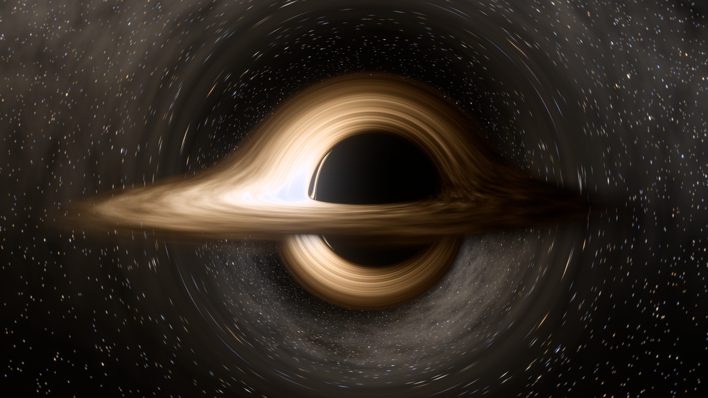
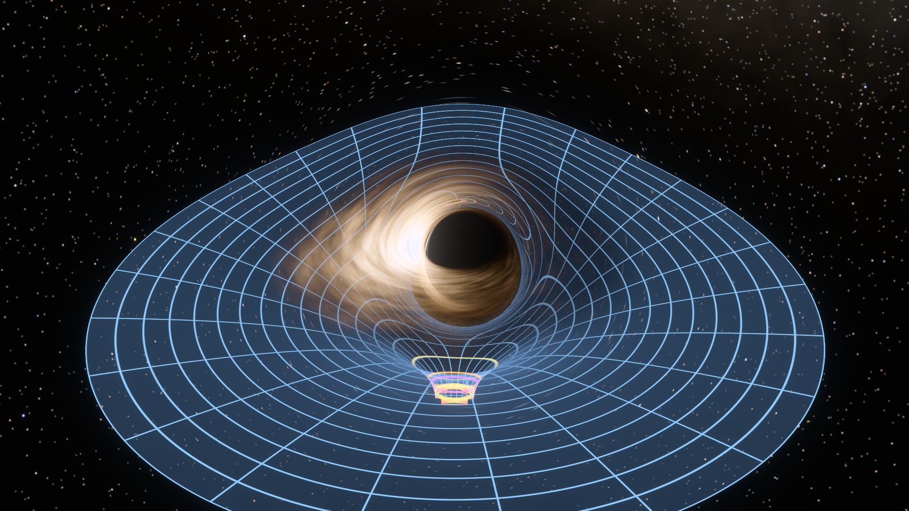
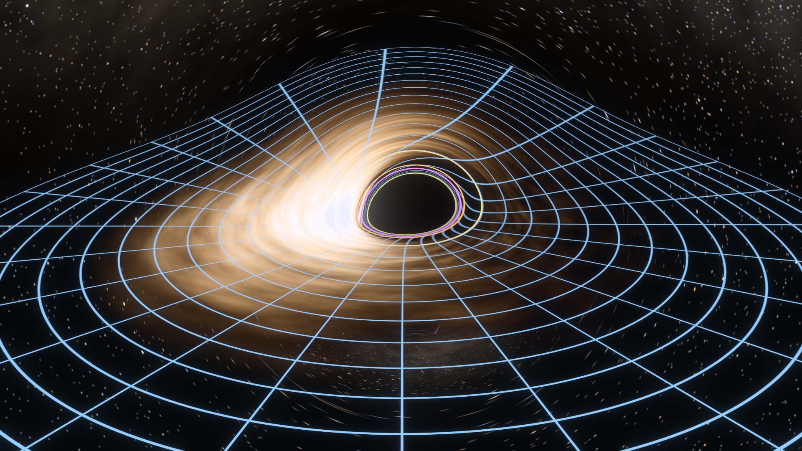
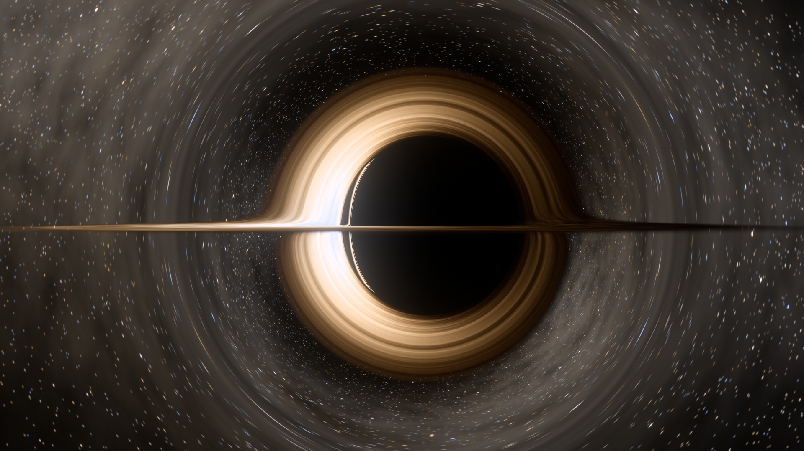
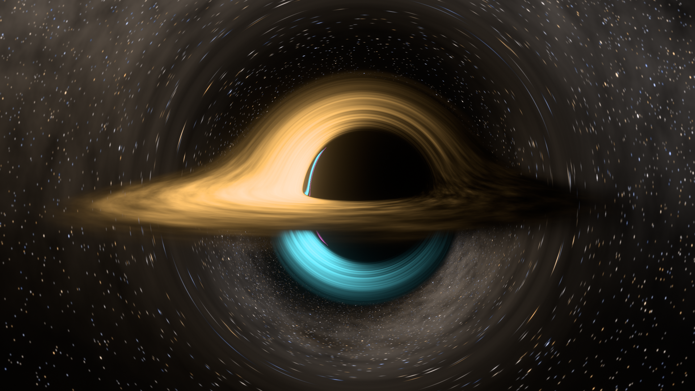
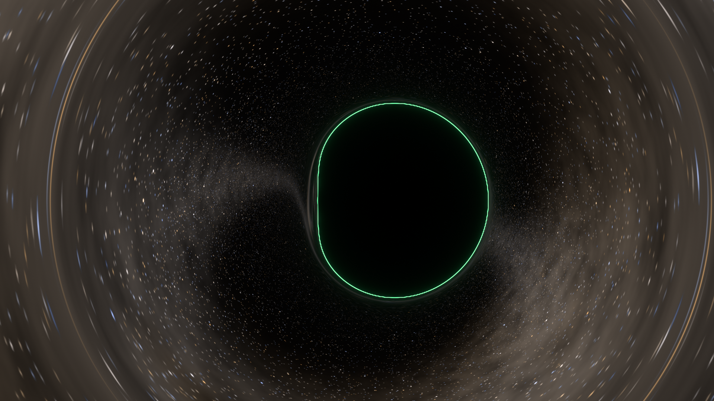
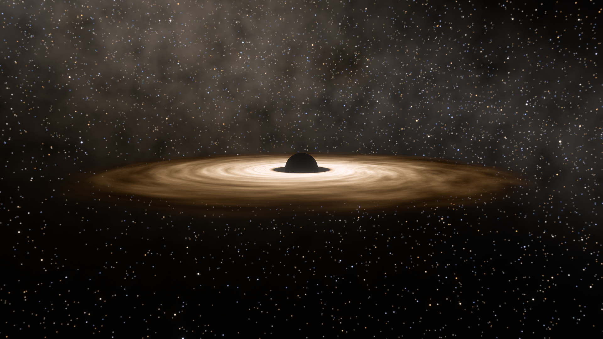

# Kerr black hole: a real-time general-relativistic ray tracer (C++ / Metal)

A physically based, real-time 3-D simulation of a spinning (Kerr) black hole on Apple GPUs:

* **Ray tracing / gravitational lensing.** Every pixel follows an exact null geodesic of the Kerr metric.
  The ray tracer produces the shadow, the photon ring, the Einstein ring of the star field, and the frame dragging.
* **Accretion disk.** A Novikov–Thorne thin disk with the Page–Thorne flux profile, blackbody colours,
  relativistic Doppler beaming, gravitational redshift and limb darkening. The "halos" (the lensed images of
  the far side of the disk arching over and under the hole, and the thin photon rings of order n ≥ 1) come
  out of the geodesics automatically. Nothing is painted in.
* **Spacetime curvature ("trapdoor").** A spacetime grid on the exact embedding diagram of the equatorial
  slice (Flamm's paraboloid, generalised to Kerr). It is ray-traced *inside* the curved spacetime, so the grid
  behind the hole is itself lensed. A second mode draws the flat coordinate grid of the equatorial plane,
  lensed.
* **Real time.** About 66 fps at full Retina resolution (3200×2000) and 135–165 fps at 1080p on an M4 Max.
  Dynamic resolution keeps 60 fps while you move. When nothing changes, the view converges progressively
  to a 256-sample supersampled image.



| | |
|---|---|
|  embedding funnel ("trapdoor"), ray-traced and lensed |  equatorial coordinate grid, lensed; coloured rings = horizon, ergosphere, photon orbits, ISCO |
|  edge-on: the disk is a line, its lensed images wrap around the shadow |  images colour-coded by order (primary / secondary / higher) |
|  a = 0.998: the analytic Bardeen shadow edge (green) on the traced shadow |  the same scene with lensing switched off |

## Build and run

Requirements: macOS 13+ on Apple silicon, Xcode (for `xcrun metal`), `make`.

```sh
make            # app + Metal library + validation suite
make run        # opens the real-time window
make test       # 85 physics checks + GPU-vs-CPU self-test
make app        # build/Black Hole.app (double-clickable)
```

`./build/bh --help` lists the headless modes: `--render out.png` (offline stills with any scene option),
`--bench`, `--selftest` and `--inputtest`.

## Controls

| input | action |
|---|---|
| drag | orbit the camera around the hole |
| right-drag / ⌥-drag | look around (free look) |
| scroll / pinch | camera distance |
| `[` `]` (`{` `}` fine) | black-hole spin a/M, from −0.998 to +0.998 (negative = retrograde disk) |
| `G` | spacetime grid: off → embedding funnel ("trapdoor") → equatorial coordinate grid |
| `L` | lensing (GR) on/off, which switches to straight rays in flat space for comparison |
| `Z` | Doppler + gravitational redshift on/off |
| `D` `T` `K` `Y` `B` | disk, disk turbulence, limb darkening, stars, bloom |
| `O` | colour the disk images by order (number of equator crossings) |
| `C` | overlay the analytic (Bardeen) shadow boundary |
| `V` | observer: hovering (ZAMO) → circular orbit → radial free fall |
| `F` | plunge: free-fall into the hole (stops just outside the horizon) |
| `A` | slow auto-orbit of the camera |
| `↑` `↓` | disk temperature (i.e. accretion rate) |
| `←` `→` | simulation speed |
| `Space` | pause time (with the camera still, the image then converges to 256 spp) |
| `-` `=` / `M` | exposure / tone map (asinh, ACES, linear) |
| `,` `.` | field of view |
| `1`–`6` | presets: classic, edge-on, face-on, spacetime grid, close-up, from below |
| `S` / `X` / `H` / `Q` | screenshot (to `screenshots/`) / reset / HUD + help / quit |

The HUD shows the live physics: horizon, ISCO and photon-orbit radii, the camera's lapse and velocity, the sky
blueshift, and the disk temperature expressed as an accretion rate for an M87\*-mass hole.

## The physics

Units are G = c = M = 1, in Boyer–Lindquist coordinates.

### Geodesics (`src/shaders/kerr_core.h`)

Carter's constants (E, L, Q) separate the Kerr null geodesic equations in Mino time λ (dλ = dσ/Σ). Rather
than integrating the first-order equations, which need ± bookkeeping at turning points and are singular at the
poles, the integrator uses an equivalent second-order system that is smooth everywhere:

* **Radial motion in ρ = 1/r.** (dρ/dλ)² = P(ρ) = ρ⁴R(1/ρ) is a *quartic polynomial*, so ρ'' = P'(ρ)/2
  exactly. Radial turning points are harmless. Spatial infinity is the finite point ρ = 0, so the sky
  direction is taken exactly at infinity rather than at some large radius.
* **Polar motion as a particle on the unit sphere.** With the θ-part of the azimuth folded in,
  Carter's Θ-equation becomes motion on S² in the potential −½a²E²n_z²:
  n'' = a²E²n_z ẑ − (|n'|² + a²E²n_z²) n. This has no coordinate singularity at the spin axis.
* **Frame dragging** is the separately integrated r-dependent azimuth φ_r' = aρ(2E − aLρ)/(1 − 2ρ + a²ρ²).
* **Coordinate time** is integrated along each ray, so the animated disk is seen with the correct
  light-travel delays for every image.

The integrator is RK4 with steps bounded in swept angle, Δρ and Δφ. After every step a manifold projection
re-imposes |n| = 1 and the conserved angular speed. Crossings of the disk plane, the embedding surface and
infinity are located by Illinois regula falsi on RK4 sub-steps. Rays moving inward inside the prograde photon
orbit r_ph⁺ are captured: every spherical photon orbit lies outside r_ph⁺, so such rays have no turning point
left. The test suite confirms this rule never changes an outcome.

**Camera.** The camera is a ZAMO (locally non-rotating observer), which is valid everywhere outside the
horizon, including inside the ergosphere. It can be Lorentz-boosted to a circular-orbit or free-fall
velocity, which gives exact aberration and Doppler shifts. Rays are traced backwards from the camera with
correctly time-reversed momenta. (In Kerr, "emitting from the camera" gives the wrong answer, because time
reversal flips the spin.)

### Accretion disk

* **Structure.** The Novikov–Thorne thin disk runs from the ISCO (Bardeen–Press–Teukolsky) to r_out. The flux
  is F = −Ω,r / (4πr(E − ΩL)²) ∫(E − ΩL)L,r dr, evaluated from first principles (zero torque at the ISCO,
  hence the dark inner rim). Temperature follows from σT⁴ = F.
* **Temperature scale.** The peak temperature is a parameter. The HUD converts it to the equivalent accretion
  rate ṁ = Ṁ/Ṁ_Edd for a 6.5×10⁹ M☉ hole. Real disks around such holes are this cool only at low ṁ; the
  default 6000 K gives the familiar warm colours.
* **Redshift.** For gas on circular geodesics, g = ν_obs/ν_emit = 1/(u^t(E − ΩL)). A blackbody seen with
  shift g is again a blackbody, at temperature gT (I_ν/ν³ is invariant). The observed colour is therefore
  exactly Planck(gT) integrated against the CIE 1931 colour-matching functions and converted to sRGB. No
  hand-tuned colour ramps are involved.
* **Limb darkening.** Chandrasekhar's electron-scattering law, I ∝ 1 + 2.06 μ, applied in the gas rest frame.
* **Turbulence.** Log-normal, MRI-like brightness fluctuations advected with the local Keplerian flow and
  continually regenerated. This is a statistical model: it adds realistic texture but it is not a simulation.
* **Sky.** The procedural star field treats every star and the Milky Way light as blackbodies, so the sky
  is blueshifted correctly for a hovering camera (×1/α) and Doppler-shifted for a moving one.

### Spacetime grid

The equatorial slice ds² = (r²/Δ)dr² + R(r)²dφ² is embedded isometrically as a surface of revolution with
dz/dr = √(r²/Δ − (dR/dr)²). For a = 0 this is Flamm's paraboloid z = √(8(r − 2M)). The vertical axis is the
fictitious embedding dimension: the funnel is a picture of the *spatial geometry*, not an object in space. The
throat is the horizon, whose equatorial circumference is 4πM for every spin. The surface is placed in the scene
with its rim at the disk plane, and rays are traced through it in the curved spacetime.

## Validation (`make test`; output in `tests/validation_output.txt`)

The same geodesic core is compiled into the Metal shader and into a C++ test suite (float and double):

| test | result (float, i.e. GPU settings) |
|---|---|
| null condition / Carter constant of initial data | residuals 1e-6 / 4e-7 |
| Schwarzschild deflection vs exact integral, b = 5.4 … 400 M | ≤ 2.3e-6 rad (double at ⅕ step: 4e-9, 4th-order convergence) |
| Schwarzschild shadow radius vs sin α = 3√3(1−2/r)^½/r | ≤ 3e-7 relative |
| Kerr capture vs Bardeen critical curve, 20,000 random rays, 7 spins | 0 disagreements |
| vs independent Boyer–Lindquist Hamiltonian integrator (Dormand–Prince 5(4)) | direction ≤ 4.4e-6 rad, disk radius median 2e-7 (double at ⅕ step: 4e-9 rad) |
| Novikov–Thorne flux vs closed form (a = 0) | 3e-5 |
| disk energy conservation ∫4πrEF dr = 1 − E_isco, 5 spins | agrees to 6 digits |
| Flamm paraboloid | 6e-13 |
| GPU vs CPU core, 7 scenes × 16,000 pixels | 0 mismatches |

A pixel is ~5e-4 rad, so the traced image is exact to well below display resolution.

## What is modelled and what is not

The disk is geometrically thin and optically thick. The model does **not** include: returning radiation or
self-irradiation, a hot corona or optically thin flow (the EHT-style images of M87\* and Sgr A\*), polarisation,
or the spectral hardening factor. Bloom stands in for a camera's point-spread function. The camera works in
Boyer–Lindquist coordinates, so a plunge stops just outside the horizon. Away from the equator, the
"circular orbit" observer is an accelerated observer moving at the local Keplerian speed.

## Layout

```
src/shaders/kerr_core.h   geodesic integrator shared by GPU and CPU (the physics)
src/shaders/bh.metal      tracing/shading, bloom, tone mapping, sky generation
src/shaders/bh_shared.h   host/GPU data layouts
src/physics.cpp           ISCO, Novikov–Thorne flux, temperature scale, embedding diagram
src/colorimetry.cpp       Planck × CIE 1931 → sRGB blackbody table
src/scene.cpp             camera frame (double precision), uniforms, HUD text
src/renderer.mm           Metal pipelines and passes
src/main.mm               window, input, HUD, frame loop, headless modes
tests/test_kerr.cpp       validation suite
```
