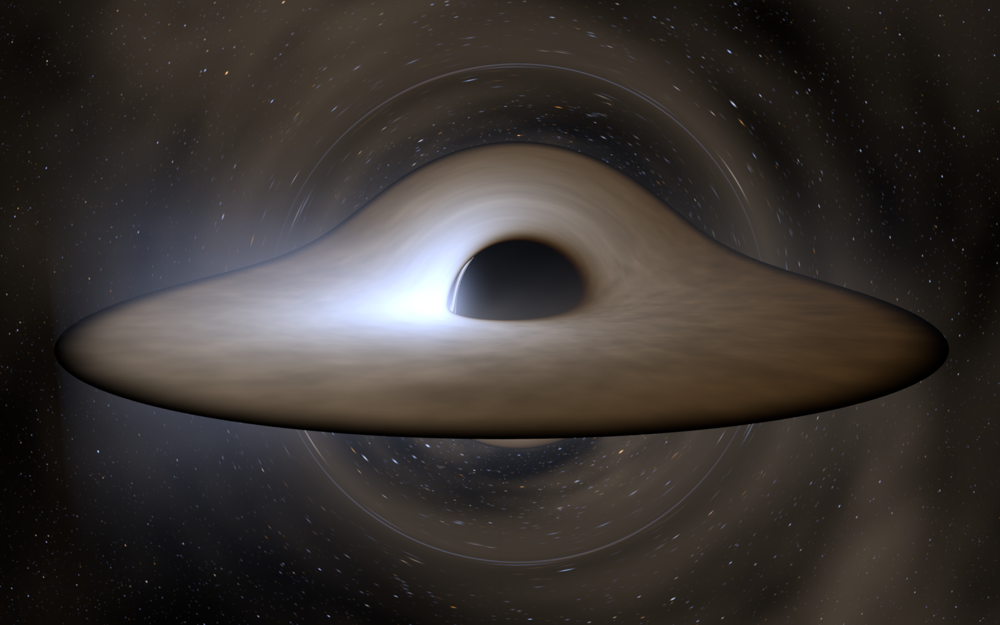
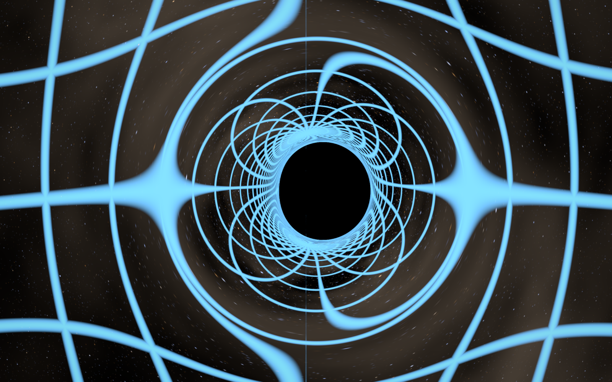
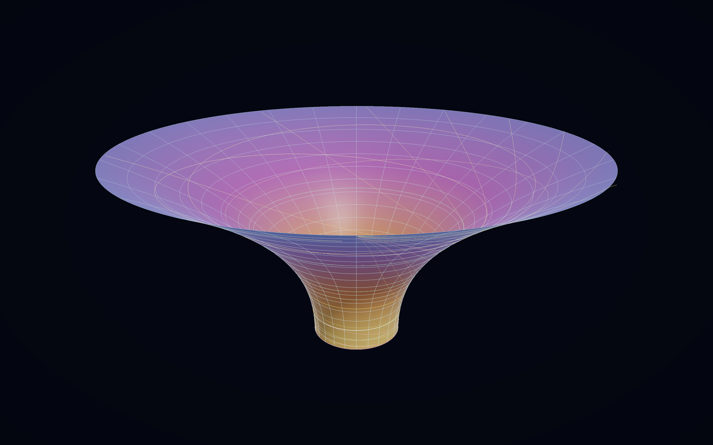
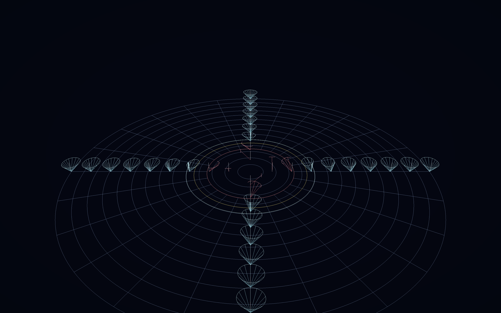
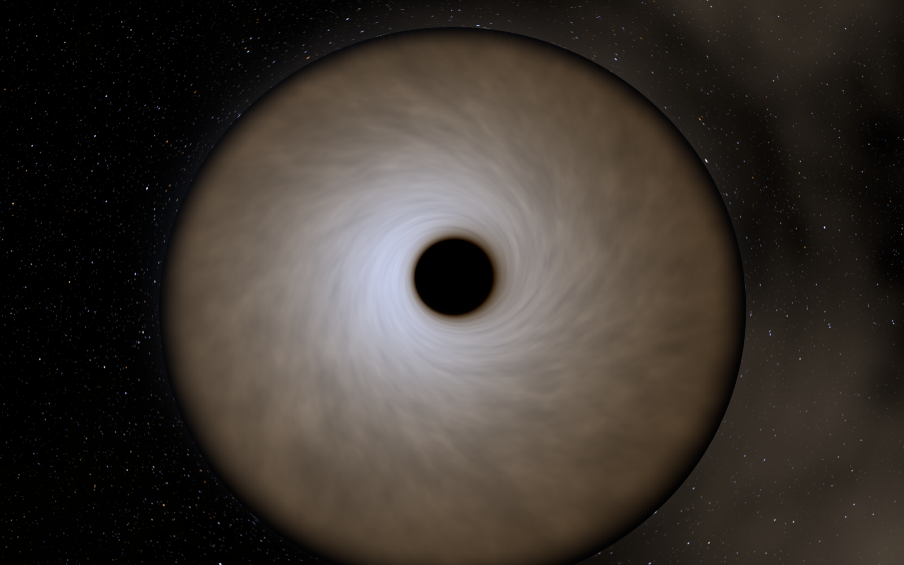

# Kerr black hole — a real-time general-relativistic ray tracer

A C++17 / OpenGL 4.1 simulation of a rotating (Kerr) black hole. Every pixel is a
photon whose null geodesic is integrated backwards through curved spacetime with an
adaptive Runge–Kutta scheme. There is no lensing approximation anywhere: the shadow,
the photon ring, the Einstein ring, the frame dragging and the Doppler beaming all
emerge from integrating the geodesic equations.

Runs at **60 fps at 2160×1350** and **34 fps at 2880×1800** on an Apple M4 Max.

```
cmake -S . -B build -DCMAKE_BUILD_TYPE=Release
cmake --build build -j8
./build/blackhole            # opens a window
./build/blackhole --verify   # runs the physics test suite
```

Requires GLFW (`brew install glfw`). macOS only, because it uses the system OpenGL
and CoreText.



*`a = 0.9`, seen from 80°. The far side of the disk arcs over the top and its
underside appears below the shadow — both are the same disk, lensed. The bright left
limb is the approaching side (`g⁴` beaming), and the thin crescent inside the shadow
rim is the photon ring.*

| | |
|---|---|
|  |  |
| A lat/long grid on the celestial sphere, lensed. The spiral pile-up at the rim is the higher-order images. | The embedding funnel: proper distance along the surface, coloured by tidal curvature. |
|  |  |
| Light cones tipping over. Symmetric far out, lopsided nearer in, one-way inside `r₊`. | Near face-on, showing the differentially rotating flow. |

---

## What it does

### 1. Ray-traced gravitational lensing (key `1`)

The camera is a **ZAMO** (zero-angular-momentum observer) at Boyer–Lindquist
coordinates `(r, θ, φ)`. For each pixel, the viewing direction is resolved onto the
ZAMO orthonormal tetrad, lowered with the co-tetrad to get the covariant photon
momentum, and integrated **backwards in affine parameter** — which is not the same
as forward-tracing in Kerr, because the time-reversal isometry is `(t, φ) → (−t, −φ)`
and reverses the frame dragging.

The Hamiltonian is written in a form where both derivatives stay cheap:

```
H = F / (2 Σ)
F = Δ p_r² + p_θ² − P²/Δ + (L − a E sin²θ)² / sin²θ
P = (r² + a²) E − a L
```

`H ≡ 0` on any null geodesic, so it doubles as a running accuracy monitor (press `v`
to see the violation map). `E = −p_t` and `L = p_φ` are exactly conserved because the
metric is stationary and axisymmetric, so only four components are integrated.

Integration is **Cash–Karp RK4(5)** with per-component error control and a step cap
tied to the distance from the horizon: about 200 steps for a typical ray, thousands
for one that winds around the photon shell.

### 2. Accretion disk and halo (key `d` cycles)

A **Novikov–Thorne** relativistic thin disk (Page & Thorne 1974, eq. 15n) — the
correct general-relativistic generalisation of Shakura–Sunyaev. The flux vanishes at
the ISCO (zero-torque inner boundary) and tends to `3Ṁ/8πr³` far out.

* Mass and Eddington ratio set a real accretion rate, hence a real temperature
  profile `T(r) = (F/σ)^¼`. The HUD shows the numbers.
* The disk is **opaque**, so the ray stops at its first equatorial crossing inside the
  annulus. This is what produces the classic picture: the far side of the disk arcs
  over the top, and its underside appears beneath the shadow.
* Equatorial crossings are found with **cubic Hermite dense output** on the RK step
  and bisected to machine precision, not by shrinking the step size.
* The gas is on a **Keplerian orbit** outside the ISCO and on a **geodesic plunge**
  conserving the ISCO's `E` and `L` inside it.
* Redshift `g = ν_obs/ν_emit` is computed from the exact `k·u` at both ends. Since a
  Doppler/gravitationally shifted blackbody is still a blackbody at `T_obs = g·T_emit`,
  the famous `g⁴` beaming falls straight out of `σT⁴` — the bright left limb is the
  approaching side, boosted by special-relativistic beaming plus the gravitational
  blueshift.
* Density fluctuations are frozen into the flow: each fluid element is labelled by the
  azimuth it had at `t = 0` and the pattern is advected with the orbit, so the disk
  shears differentially the way it should.
* An optional **optically thin halo** is integrated along the ray with the bolometric
  transfer `dI = g⁴ j dλ`, giving the corona glow and the higher-order photon subrings.

Colour comes from integrating the Planck spectrum against the **CIE 1931 observer** and
converting XYZ → linear sRGB, with out-of-gamut colours desaturated rather than clipped.

> **On colour.** A real thin disk is *hot* — 10⁷ K for a stellar-mass hole at
> Eddington, 10⁵–10⁶ K for an AGN. Its true colour is a featureless blue-white, and
> most of its light is ultraviolet or X-ray. Press `c` to see that honestly. The
> default view instead applies a **linear rescale of temperature**, `T → αT`, which is
> exactly the picture of an identical disk that happens to be cooler by a constant
> factor: every ratio, including the Doppler and gravitational shifts, is preserved.
> The famous orange movie disks are not physical.

### 3. Spacetime curvature — the trapdoor

**Embedding funnel (key `2`).** An isometric embedding of the equatorial plane at
fixed `t`, drawn as a grid. Distance measured *along the surface* is proper distance,
so the funnel is literally the extra space the hole adds. The height is integrated
from

```
dz/dr = sqrt( g_rr − (dR/dr)² ),   R(r) = sqrt(r² + a² + 2a²/r),  g_rr = r²/Δ
```

which reduces to Flamm's paraboloid `z = 2√(2M(r−2M))` at `a = 0`. The throat is the
horizon: a trapdoor at the bottom of the well. The surface is coloured by the
**Kretschmann scalar**, the coordinate-independent measure of tidal curvature. Exact
geodesics are drawn on it — circular orbits, precessing ellipses, plunges, and
photons sweeping past.

**Light cones (key `3`).** The causal version of the same statement, in **ingoing
Kerr–Schild coordinates**, which stay regular across the horizon where Boyer–Lindquist
breaks down. At each sample point the future light cone is computed by solving the
null condition for the metric directly, and the cross-section at one time step is
drawn. Because that cross-section is exactly linear in the time height, every cone in
the picture is drawn at the same scale and can be compared directly.

* **Blue** — normal region: the vertical (staying still) is inside the cone.
* **Orange** — inside the ergosphere, `g_tt > 0`: the vertical has left the cone.
  No static observers exist; you *must* corotate.
* **Red** — inside `r₊`: no future direction has `dr > 0`. The trapdoor.

### 4. Background

Procedural stars carry a **temperature**, not just a brightness, so the gravitational
shift `g = 1/E` is applied to their colour as well as to their flux (`∝ g⁴`). Near the
shadow the sky is magnified enormously and the stars pile up into the Einstein ring.
Press `g` for a lat/long grid painted on the celestial sphere — the clearest single
demonstration of what the hole does to the map from sky directions to image directions.

---

## Verification

`./build/blackhole --verify` runs the renderer's own geodesic machinery against
closed-form results from the literature. Same Hamiltonian, same Cash–Karp integrator
as the GPU shader, run in double precision. **52/52 pass.**

| Test | Result |
|---|---|
| Light deflection vs. Keeton–Petters series, `b` = 50…2000 M | to 2×10⁻¹⁰ relative |
| Shadow edge vs. Bardeen (1973), `a` = 0, 0.5, 0.9, 0.998 | to 10⁻¹⁰ relative |
| Circular orbits: radius drift and `dφ/dt` vs. Kepler after 3 orbits | to 10⁻¹⁴ |
| Photon-shell orbit radius drift, `a` = 0, 0.5, 0.9 | exact |
| `dE/dr = 0` at the ISCO | to 10⁻⁹ |
| Periapsis advance vs. `6πM/p` | 0.5–2 % (the expected `O(1/p)` correction) |
| ZAMO lapse = gravitational redshift; frame-dragging `ω`; horizon area | exact |
| Novikov–Thorne flux → 0 at ISCO, → `3Ṁ/8πr³` far out | to 3×10⁻⁴ |
| Radiative efficiency `1 − E_isco`: 5.72 % at `a` = 0, 32.1 % at `a` = 0.998 | matches |
| Constraint `\|H\|/E²` along strongly bent rays | ~10⁻¹⁰ |

The shadow test is the strongest one: it launches rays through the *same camera
pipeline the shader uses* — ZAMO tetrad, co-tetrad, backwards integration — bisects on
capture, and recovers Bardeen's analytic `ξ(r_ph)` for the prograde and retrograde
shadow edges to ten digits, including the asymmetric Kerr "dent".

It also prints sanity figures: a 10 M☉ hole at Eddington peaks at **7.0×10⁶ K**
(soft X-ray); a 10⁷ M☉ hole at 0.3 Eddington with `a` = 0.9 peaks at **2.9×10⁵ K** (UV).

---

## Controls

| | |
|---|---|
| drag / scroll | orbit, zoom |
| `1` `2` `3` | ray trace \| embedding funnel \| light cones |
| `[` `]` | spin `a/M` |
| `-` `=` | disk outer radius |
| `;` `'` | black hole mass |
| `,` `.` | accretion rate |
| `d` | disk mode: off / opaque / disk+halo / halo only |
| `c` | colour: physical Planck ↔ rescaled to visible |
| `m` | tone curve: asinh / ACES / linear |
| `g` `n` `t` | sky grid, nebula, disk turbulence |
| `v` | diagnostic view: RK steps / \|H\| violation / redshift |
| `9` `0` | integrator step budget |
| `o` `p` | exposure |
| `b` | bloom |
| `space` | pause disk rotation |
| `a` | progressive accumulation |
| `j` `k` | render resolution |
| `f` | save PNG |
| `r` | reload shaders (they hot-reload on save too) |
| `h` | hide help |

Command line: `--spin --mass --edd --incl --dist --disk-outer --steps --scale
--width --height --view --disk-mode --tonemap --debug --exposure --bloom --grid
--nebula --stars --corona --turb --bench --frames --shot --verify --help`.

---

## Layout

```
src/kerr.hpp        Kerr metric, geodesic Hamiltonian, Cash-Karp RK4(5),
                    ZAMO tetrad, Novikov-Thorne disk. Double precision.
src/spectrum.*      Planck radiometry, CIE 1931 -> sRGB, disk temperatures.
src/geometry.*      Embedding funnel, Kerr-Schild light cones, geodesic curves.
src/verify.cpp      The physics test suite.
src/app.cpp         Window, camera, render graph, HUD, input.
src/glutil.*        Shader hot-reload, float render targets, LUT textures.
src/text.mm         CoreText glyph atlas for the overlay.
shaders/blackhole.frag   The ray tracer. This is the interesting one.
shaders/post.frag        asinh / ACES tone mapping.
shaders/bloom.frag       Karis downsample, tent upsample.
shaders/mesh.*           The two 3-D spacetime views.
```

Units are geometrized (`G = c = M = 1`) throughout; lengths are in gravitational
radii `r_g = GM/c²`.

## Notes on the rendering

* **Progressive accumulation.** When the camera is still, jittered samples are
  averaged with weight `1/n` and the image converges. While the disk turns it
  degrades gracefully into a short temporal filter, which still anti-aliases the
  photon ring and the lensed stars.
* **Tone mapping.** A Novikov–Thorne disk spans roughly 1000:1 in surface brightness
  between the ISCO and its outer edge. No linear or filmic curve shows that at once,
  so the default is an **asinh stretch** — what astronomers use for exactly this
  reason. Luminance is compressed; hue and saturation are untouched. `m` switches to
  ACES or to a linear clip if you want to inspect raw values.
* Shaders are loaded from disk at runtime and hot-reload when the file changes.
