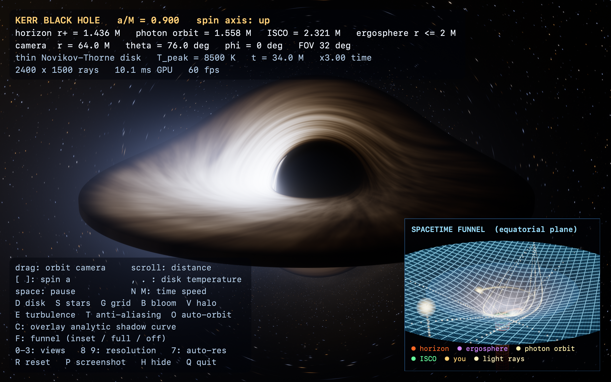
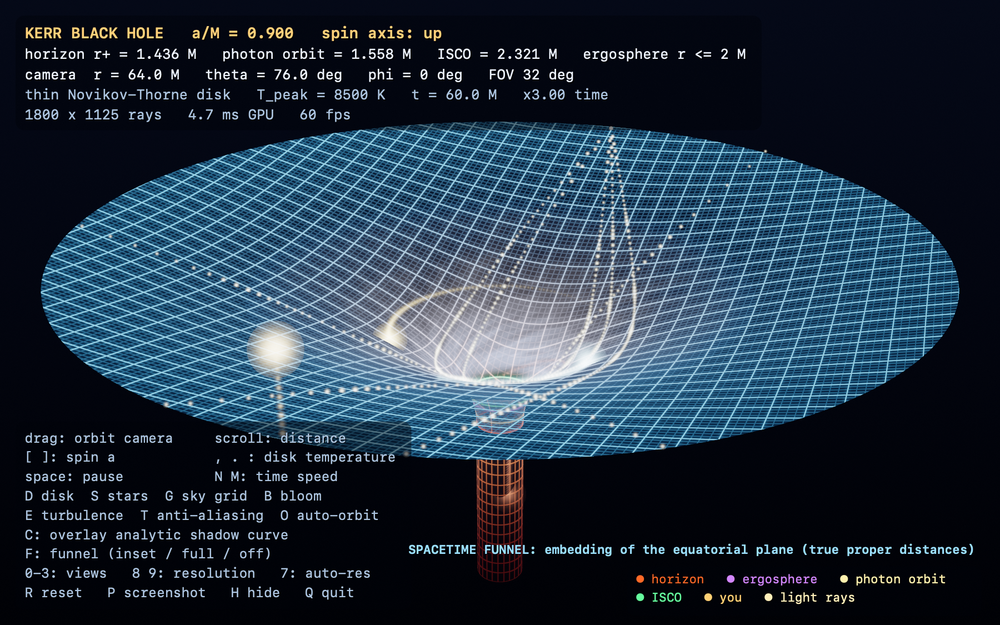
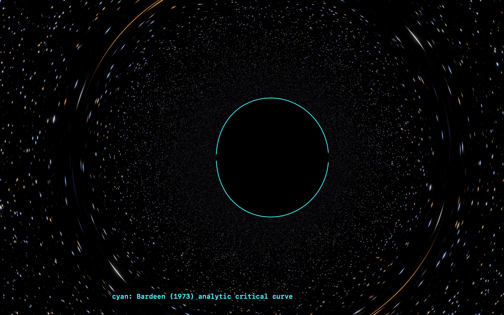
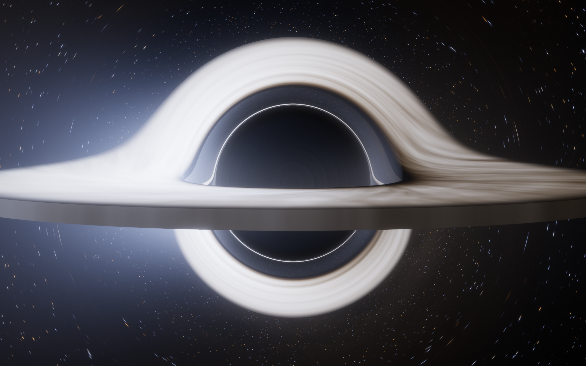
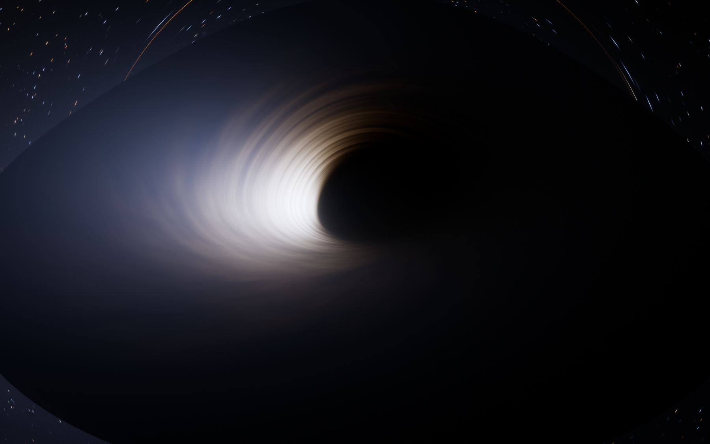
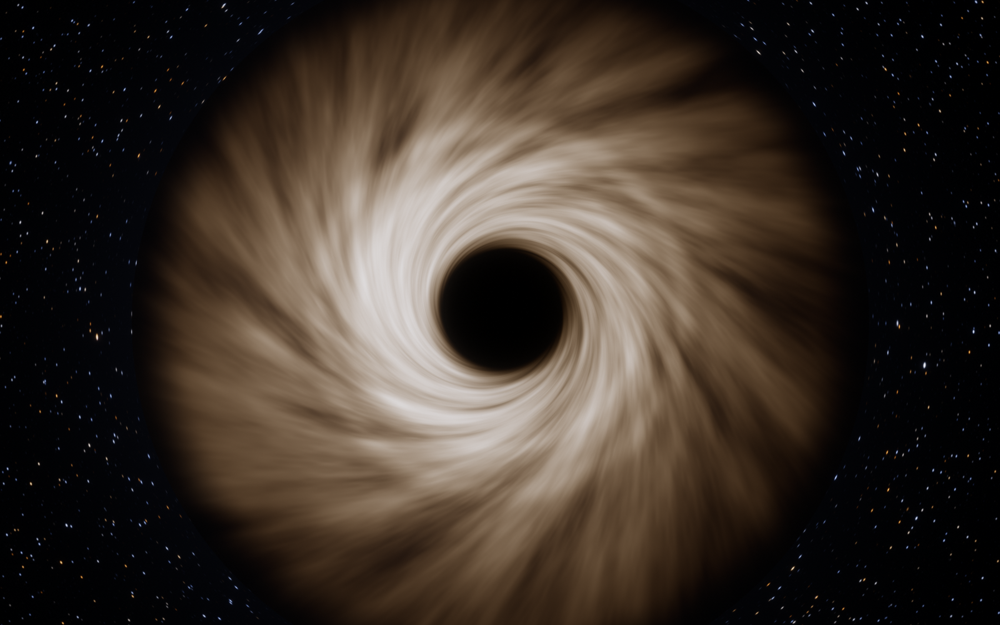
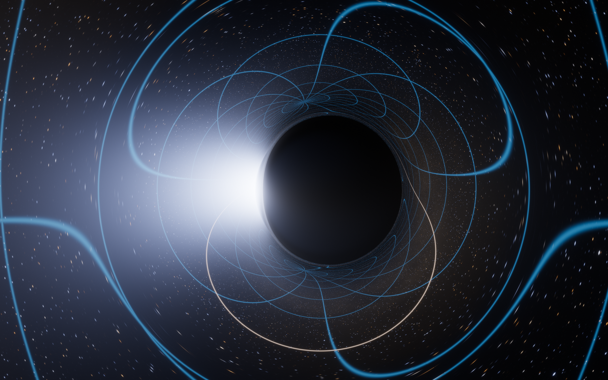
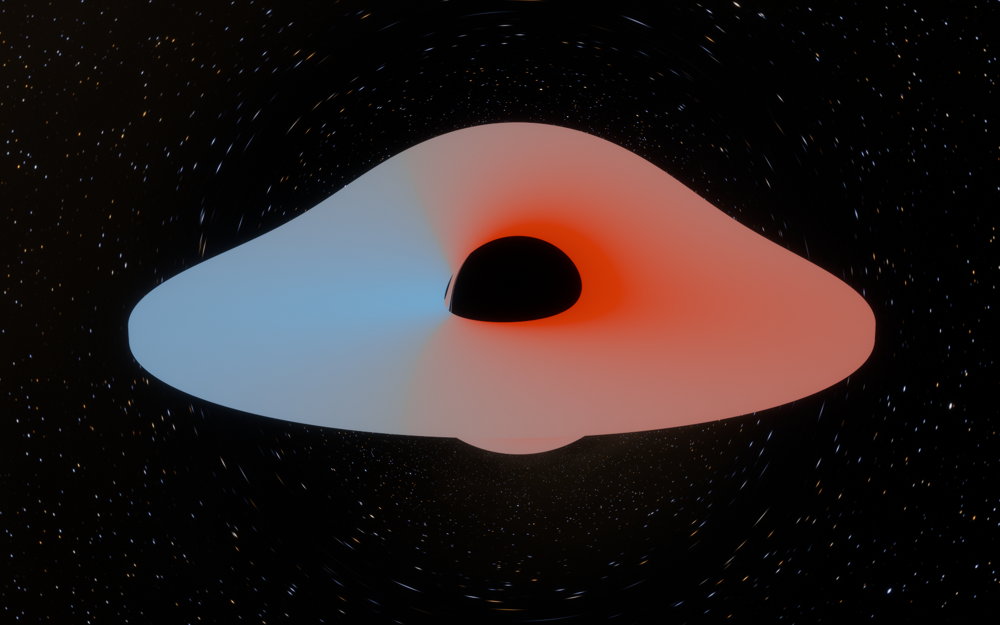
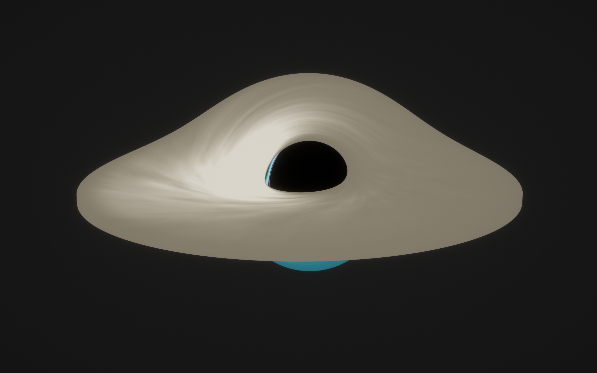

# Kerr black hole — real-time geodesic ray tracing in C++ / Metal

A physically accurate, interactive simulation of a **spinning (Kerr) black hole**. Every pixel is a null
geodesic integrated through the Kerr metric on the GPU, so gravitational lensing, the shadow, the photon ring,
the Doppler-beamed accretion disk and the lensed starfield all come out of the same equations — nothing is faked
with a lookup texture or a post-process warp. A second view shows the **spacetime funnel** — the embedding diagram
of the curved geometry with test particles and light rays moving on it.



```
./run.sh            # builds and opens the window (needs macOS + Xcode command-line tools; any Metal GPU)
```

Everything lives in this folder. Sources are in `src/` (C++17 + a little Objective-C++ for the window and Metal API,
Metal Shading Language for the GPU), tests in `src/selftest.cpp`, screenshots and the validation log in `docs/`.

## What is on screen

| Feature | How it is done |
|---|---|
| **Gravitational lensing** | Backward ray tracing: one Kerr null geodesic per pixel from a zero-angular-momentum observer, integrated to infinity (or the horizon / the disk). Einstein-ring arcs, the shadow, higher-order images and the photon ring emerge automatically. |
| **Accretion disk** | Thin Novikov–Thorne disk (Page & Thorne 1974 flux, exact Kerr circular orbits) from the ISCO to 20 M with a thin photosphere `|cos θ| < H/r` (top, bottom, outer rim and inner wall are all intersected by the rays). Colour = blackbody at `g·T`, so **Doppler beaming, gravitational redshift and relativistic aberration are exact**; limb darkening; turbulence advected by Keplerian shear with light-travel-time retardation, so the pattern you see on the far side of the hole is *older* than the near side. |
| **Halos** | (1) an optically thin hot corona integrated along each geodesic with the invariant `I = ∫ j g³ dλ_affine` (Doppler-shifted, brighter on the approaching side); (2) HDR bloom; (3) the lensed secondary/higher-order images of the disk (the "halo" over and under the shadow). |
| **Spacetime curvature** | *Funnel view* (`F`): the equatorial `t = const` slice of Kerr embedded as a surface of revolution, `ρ² = r² + a² + 2a²/r`, `dz/dr = √(r²/Δ − ρ'²)`. Distances measured along the sheet are the true proper distances; a flat sheet would be an empty universe. A square lattice, the horizon, ergosphere, photon orbit and ISCO rings, the observer, real Kerr **timelike geodesics** (circular, precessing eccentric, plunging) and **null geodesics** (light rays bending around the well) live on it. The throat continues down as the "trapdoor". |
| **Lensed sky grid** | `G` draws a latitude/longitude grid on the celestial sphere *as seen through the lens*. |
| **Real time** | ~3 ms/frame at 1400×875 and ~12 ms at native Retina 3000×1880 on an M4 Max with an idle GPU (≈20–30 integrator steps per ray on average; timings roughly double when other apps load the GPU). Dynamic resolution + progressive jittered anti-aliasing when the camera rests. |



## Controls

| Input | Action |
|---|---|
| drag | orbit the camera (drag inside the funnel inset to rotate the funnel) |
| scroll / pinch, `-` `=` | camera distance (2.4 M … 1000 M) |
| `[` `]` | black-hole spin `a/M` (0 … 0.998) — the funnel, ISCO, photon orbit, disk flux table all update |
| `,` `.` | peak disk temperature (colour) · `;` `'` exposure |
| `space` | pause · `N` `M` time speed |
| `D` disk · `S` stars · `G` lensed sky grid · `B` bloom · `V` corona halo · `E` disk turbulence · `T` temporal AA | toggles |
| `F` | funnel: inset → fullscreen → off |
| `C` | overlay Bardeen's analytic shadow curve (validation, see below) |
| `0` `1` `2` `3` | views: normal · image order (direct / 1st lensed / …) · redshift map · integrator cost per ray |
| `O` auto-orbit · `Z` `X` field of view · `8` `9` render scale · `7` auto-resolution | |
| `R` reset · `P` screenshot to Desktop · `H` hide HUD · `Q`/Esc quit | |

Command line (all optional): `--spin 0.9 --incl 76 --dist 64 --fov 32 --tpeak 8500 --exposure 1 --rout 20 --thick 0.02
--halo 0.45 --funnel 0|1|2 --curve --view 0..3 --paused --time T`, and
`--shot out.png --size 2400x1500 --frames 90` renders offscreen without opening a window,
`--bench` prints GPU timings, `--selftest` runs the full validation suite, `--auto-quit 10 --window-shot w.png`
captures the live window.

## The physics

Units `G = c = M = 1`, Boyer–Lindquist coordinates `(t, r, θ, φ)`, spin `a = J/M`.

**Geodesics.** A photon carries conserved `E = 1`, `L = p_φ` and Carter's `Q`. In Mino time
(`dτ_affine = Σ dλ`) the equations separate:

```
(dr/dλ)² = R(r)  = (r²+a²−aL)² − Δ [Q + (L−a)²]
(dμ/dλ)² = M(μ)  = Q − (Q+L²−a²) μ² − a² μ⁴          μ = cos θ
dφ/dλ = a(r²+a²−aL)/Δ − a + L/(1−μ²)
dt/dλ = (r²+a²)(r²+a²−aL)/Δ + a(L − a(1−μ²))
```

The integrator (`src/kerr_shared.h`) uses several choices that matter for accuracy and robustness — most of them
were forced by bugs the test-suite found:

* **`u = 1/r` as the radial variable**, integrating the *second-order* polynomial forms `u'' = F'(u)/2`,
  `μ'' = M'(μ)/2`: no square roots or sign flips at turning points, regular at the horizon and at infinity, O(1)
  everywhere. (Integrating `r` itself is hyperbolic, `r'' ≈ 2r³`, and amplifies RK4's constraint error so much
  that a camera 10⁴ M away misplaces the shadow.) A ray needs ~20–30 RK4 steps instead of ~150.
* **`sin²θ` as its own state variable** (exact polynomial ODE for `w''`), so `dφ/dλ = L/w` stays accurate arbitrarily
  close to the polar axis, where `1−μ²` loses all its float32 digits.
* **Constraint projection** after every step (`u'² = F(u)`, `μ'² = M(μ)` or the `w`-form): RK4 conserves the first
  integrals only to `O(h⁴)`, and for rays that skim the polar axis that error is larger than the potential itself
  and used to scramble the azimuth of the sky (a visible seam down the middle of the image).
* A **regularised coordinate time** `t̂ = t + ∫|dr|` (which is O(log r), not O(r)) so light-travel delays used for the
  disk animation are accurate; the accumulated `|Δr|` is subtracted analytically.
* An **observer = ZAMO** at `(r₀, θ₀)`; view directions map to `(L, Q)` through the exact local frame, including
  frame dragging. The camera's measured photon energy `ν_cam` gives the blueshift of the sky when you sit deep in the
  well.
* The disk photosphere is an opaque wedge `|cos θ| < H/r`; the tracer takes the earliest hit among the top/bottom cones,
  the outer rim and the inner wall (each located with a Hermite root-find inside the step).

The same header is compiled twice — as C++ with `double` for the tests, and as Metal Shading Language with `float`
for the shader — so the shader is literally the code that is validated.

**Disk.** Flux from the Page–Thorne integral `F = (Ṁ/4πr) (−Ω') (E−ΩL)⁻² ∫ (E−ΩL) L' dr` with exact Kerr circular-orbit
`E, L, Ω`; `T_eff ∝ F^{1/4}`. Emission colour is a Planck spectrum integrated against the CIE 1931 colour matching
functions; a photon that arrives with frequency ratio `g = ν_obs/ν_em = ν_cam / [u^t(1−ΩL)]` sees a blackbody of
temperature `gT` (`I_ν/ν³` is invariant), which reproduces the `g³/g⁴` beaming exactly. Peak temperature is normalised
by the visible luminance of a `T_peak` blackbody, so `T_peak` changes the *colour* and exposure controls the *brightness*.

## Validation

`./build/blackhole --selftest` (full log in `docs/validation.txt`) runs **41 CPU checks in double precision, 3 GPU-vs-CPU
parity runs (30 720 rays) and 4 GPU shadow-edge tests**. All pass. Highlights:

| Check | Result |
|---|---|
| ISCO `a = 0, 0.9, 0.998` vs known values | 6.000000, 2.320883, 1.23697 |
| Schwarzschild critical impact parameter `3√3 = 5.196152` (camera at 10⁴ M, bisection on capture/escape) | error < 10⁻¹⁵ in double for every step size; 2·10⁻⁷ in float32 |
| Light deflection `b = 8, 20, 100 M` (swept angle 3.9997, 3.3763, 3.1749 rad) vs an independent numerical quadrature of the exact Schwarzschild orbit equation | agree to ≤ 3·10⁻⁷ rad |
| Kerr shadow edge vs **Bardeen (1973)** analytic critical curve, `a = 0.9`, inclination 17°, 60°, 90° | 13/13, 35/35, 39/39 curve points bracketed at ±0.1 % |
| Same comparison on the **GPU** through the exact camera model (`a = 0, 0.5, 0.9, 0.998`) | 98–100 % of points bracketed at ±0.4 % (≈1 px) |
| Novikov–Thorne flux, closed form (Page & Thorne 15n) vs numerical integral of its definition | agree to 5·10⁻¹⁰; Newtonian limit `→ 1` |
| Face-on Schwarzschild redshift `g = √(1−3/r)` | 1.6·10⁻⁴ |
| Approaching side of the disk is blueshifted (left of the image for a spin pointing up) | ⟨g⟩ = 1.07 vs 0.76 |
| Flamm paraboloid recovered from the Kerr embedding at `a = 0`; throat circumference radius `ρ(r₊) = 2M` for every spin | exact |
| Test particle: periapsis advance vs `6π/p` (weak field) | 0.2468 vs 0.2356 rad/orbit (5 % — first-order formula) |
| Radial photon time delay vs tortoise coordinate | 4·10⁻³ M |
| Polar-axis rays: sky direction smooth across the axis; converged `c = 0.1` vs `0.01` | 1·10⁻⁵ rad |
| GPU float32 vs CPU double on 10 240 rays × 3 configs: identical capture/escape/disk status on **all** rays; disk-hit radius p99.9 ≤ 5·10⁻⁴, redshift p99.9 ≤ 1·10⁻⁴, escape direction p99.9 ≤ 7·10⁻⁴ rad | see log |

Press `C` in the app to see the analytic curve drawn on the live render: the upper half is on the shadow edge in the
normal view (the near side of the disk hides the lower half), and with the disk off (`D`) the whole closed curve sits
exactly on the edge of the starfield's cut-off:



## Gallery

| Schwarzschild, edge-on (`a = 0`, 86°) | Near-extremal Kerr (`a = 0.998`, 62°) |
|---|---|
|  |  |
| **Face-on**: Keplerian shear winds the turbulence into spirals | **Lensed celestial grid** (disk off) |
|  |  |
| **Redshift map** (`2`): blue approaching, red receding | **Image order** (`1`): direct / first / second lensed image |
|  |  |

## Architecture

```
src/kerr_shared.h     Kerr geodesic core — ONE source for C++ (double, tests) and MSL (float, GPU)
src/physics.cpp       ISCO, Page–Thorne flux, blackbody→sRGB tables, embedding diagram, timelike geodesics
src/selftest.cpp      the CPU validation suite (also `make build/selftest` → CPU-only binary)
src/shaders/          common.metal (noise, blackbody, tone-map) raytrace.metal  post.metal  funnel.metal
src/renderer.mm       Metal pipeline: raytrace → TAA resolve → bloom pyramid → funnel pass (4× MSAA) → present + HUD
src/main.mm           window, input, CLI, screenshots, GPU parity + shadow tests
tools/bundle_shaders.sh   concatenates header + shaders; the app compiles them at start-up (no offline Metal toolchain needed)
```

Each frame: a compute kernel traces one Kerr geodesic per pixel into an HDR texture; a temporal resolve accumulates
sub-pixel jitter for static content (moving disk pixels are blended faster and clamped to their neighbourhood); a
6-level bloom pyramid adds the glow; the funnel is rendered into its own 4× MSAA target; and a fragment pass upsamples
(Catmull-Rom), tone-maps (ACES), composites the inset and the Core Text HUD.

## Honest limitations

* The disk is a *thin* Novikov–Thorne disk with a thin photosphere; there is no emission inside the ISCO, no
  self-irradiation, no polarisation, and the corona is a simple optically thin model (its amplitude is a look
  parameter). Colours are physical blackbody colours, but the absolute temperature scale is a free parameter.
* The observer is a ZAMO teleporting around the hole; a camera moving relativistically (aberration of the sky) is
  not modelled. The sky is a procedural star field, not a catalogue.
* The funnel shows the exterior slice only; the tube below the horizon is schematic. Test particles are drawn in
  Boyer–Lindquist coordinate time, so a plunging particle appears to slow and fade near the throat, exactly as a
  distant observer would see it.
* Float32 limits: the last ≈0.1 % of rays that orbit the photon sphere many times are cut at 512 steps and drawn
  dark (they converge on the critical curve anyway); rays within ≈10⁻⁵ rad of the polar axis are resolved by the
  dedicated `sin²θ` variable but a 5·10⁻⁴ floor is put on `|L|` (a 10⁻⁵ rad camera nudge).
