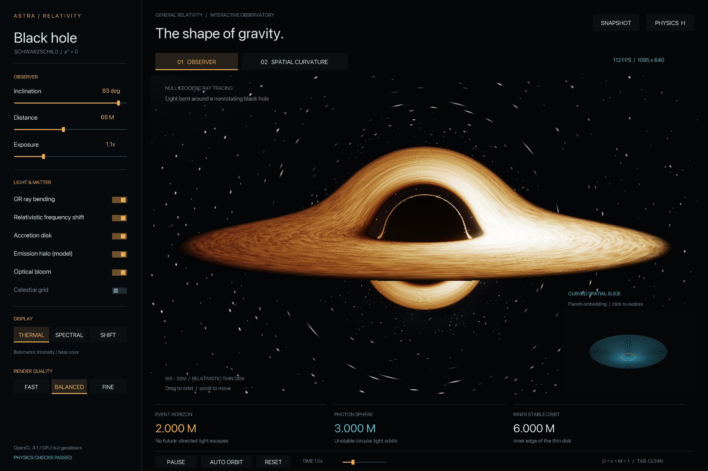
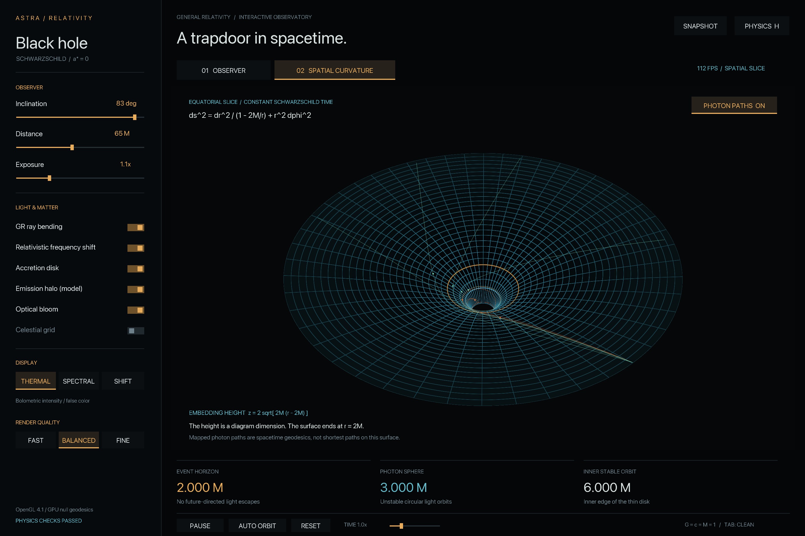

# Astra — a relativistic black hole in C++

A native, interactive C++17 / OpenGL 4.1 application. Every image pixel follows a numerically integrated null geodesic through Schwarzschild spacetime. The window includes an animated accretion disk, gravitational lensing of the sky and disk, relativistic intensity shifts, emission halos, and an interactive 3D curvature grid.

**Run:** double-click **`Astra Black Hole.app`** to open the simulation directly. To rebuild first, double-click `Launch.command`, or run `./Launch.command` from this folder. The command-line executable is `build/black-hole`.



## Explore

| Input | Action |
|---|---|
| **1**, **2** | Observer / spatial curvature views |
| Drag the scene | Orbit the observer or the grid |
| Scroll | Move closer / farther |
| **Space** | Pause time |
| **O** | Automatic camera orbit |
| **R** | Reset camera and physical/display controls |
| **G** | Celestial coordinate grid, lensed by the hole |
| **L** | Toggle relativistic light bending for comparison |
| **D** | Disk on / off |
| **B** | Optical bloom on / off |
| **C** | Thermal false color / spectral / frequency-shift diagnostic |
| **T** | Procedural disk texture on / off |
| **S** | Background stars on / off |
| **Q** | Cycle Fast / Balanced / Fine |
| **Tab** | Hide the interface for a clean view |
| **H** | Physics explanation |
| **F12** | Save a full-resolution PNG in `captures/` |
| **Esc** | Close explanation, or exit |

The side panel exposes inclination, distance, exposure, disk emission, frequency shifts, halo emission, sky grid, color mode, and resolution. The small curvature preview is clickable. In the curvature view, the **Photon paths** button shows representative captured and escaping null rays mapped onto the surface. Marker motion along these paths is an illustration, not a physical clock.

## Physical scope

The spacetime is an exact **nonrotating, uncharged Schwarzschild solution**, with geometric units **G = c = M = 1**. Its light paths are integrated numerically, with finite precision and finite step size. The camera uses a static local orthonormal frame, rather than treating coordinate components as Euclidean light velocities.

- The event horizon is at **2M**, the unstable photon orbit at **3M**, and the thin disk starts at the **6M ISCO**.
- Rays can wind around the hole. Lensed arcs and higher-order disk images emerge from disk intersections along those rays; no artificial bright ring is painted around the hole.
- The disk uses the **Page–Thorne Schwarzschild zero-torque flux profile**, circular orbital angular frequency `Omega = r^(-3/2)`, and retarded emission time.
- Frequency shifts include gravitational redshift, transverse Doppler shift, and line-of-sight Doppler shift. Bolometric specific intensity transforms as **g^4**.
- An optional, explicitly prescribed, static, optically thin corona is integrated along each ray with gravitational transfer. It supplies a faint emission halo. Optical bloom is a separate display effect and can be disabled.
- The curvature grid is **Flamm's paraboloid**, an isometric embedding of the equatorial exterior spatial slice at constant Schwarzschild time. Its height is a diagram coordinate. It does not depict an actual downward force or the black hole interior.

The default amber thermal palette is **false color** applied to bolometric intensity. Spectral mode instead samples a Planck spectrum at three wavelengths, with a fixed peak-temperature normalization of 82,000 K; this is an illustrative RGB detector, not a calibrated astronomical image. The shift diagnostic colors the frequency ratio `g` (blue for `g < 1`, warm for `g > 1`); it is a color scale, not the perceived optical wavelength.

The disk is an emitting, opaque, infinitesimally thin, steady accretion model with an advected procedural brightness texture. **This is not a GRMHD fluid simulation.** It does not solve evolving gas density, viscosity, magnetic fields, disk self-gravity, black-hole growth, spin/frame dragging, scattering, or polarization. Disk material inside the ISCO is not modeled. The halo emissivity and the star field are synthetic. Disabling individual physical effects produces comparison views, not a new self-consistent spacetime.

See [the equations and numerical assumptions](docs/PHYSICS.md) for derivations and references.



## Build and validate

Dependencies: C++17 compiler, CMake, pkg-config, GLFW 3, FreeType, libpng, and desktop OpenGL 4.1. These were already installed on the target Mac. A new macOS installation can obtain the libraries using `brew install cmake pkg-config glfw freetype libpng`.

```sh
cmake -S . -B build -DCMAKE_BUILD_TYPE=Release
cmake --build build --parallel 6
ctest --test-dir build --output-on-failure
./build/black-hole --validate-gpu
./build/black-hole
```

`Validate.command` runs the build and both validation stages. GPU validation creates an invisible OpenGL context and reads back floating-point ray results; a desktop graphics session is required. It also runs at application startup. Reports are saved in `work/gpu-validation.txt`.

The CPU suite checks capture/escape around `b = sqrt(27) M`, the photon orbit, the conserved null invariant, weak-field bending against an analytic expansion, fourth-order convergence, the flat-space control, the spatial embedding metric, frequency shifts, and the disk boundary and flux maximum. GPU tests compare eight impact parameters at **all three quality settings** with the independent double-precision reference solver, then test **1,000 actual perspective-camera rays** against the analytic capture boundary.

Measured on this Mac's **Apple M4 Max**, with a 1440 × 960 window and a 2880 × 1920 framebuffer:

| Mode | Ray-traced resolution | Measured average |
|---|---:|---:|
| Balanced | 1095 × 640 | ~114 FPS over 590 measured frames |
| Fine | 1711 × 1000 | ~97 FPS over 170 measured frames, including PNG capture |

These are short local wall-clock measurements after ten warm-up frames, not performance guarantees. Resolution varies with the window aspect ratio. The interface and grid render at the framebuffer resolution; the ray-traced image is upscaled. There is no temporal accumulation. Fine uses more pixels and smaller angular steps, but single-precision roundoff can still dominate sufficiently close to the critical curve.

For repeatable captures or your own timing:

```sh
./build/black-hole --frames 600 --quality 1
./build/black-hole --frames 180 --quality 2 --capture captures/my-observer.png
./build/black-hole --view curvature --frames 180 --capture captures/my-grid.png
./build/black-hole --clean
```

Additional flags: `--size W H`, `--hidden`, `--help`. The minimum interactive window is 1280 × 920 logical pixels.

## Project layout

- `src/main.cpp`: native window, input, application state, layout, PNG capture.
- `src/graphics.cpp`: OpenGL rendering, curvature geometry, and GPU validation.
- `src/ui.cpp`: custom interface, with a system font rasterized by FreeType.
- `include/physics.hpp`: independent double-precision physics reference.
- `shaders/raytrace.frag`: null-geodesic integrator and radiative transfer.
- `shaders/mesh.*`: exterior spatial embedding and grid.
- `shaders/blur.frag`, `post.frag`: optional bloom and display tone mapping.
- `tests/physics_tests.cpp`: analytic and numerical checks.
- `captures/`: rendered PNGs; `work/`: logs; `build/`: generated binaries.

The code and procedural visuals were authored for this project. No other black-hole implementation or external visual assets were used. GLFW, FreeType, and libpng provide general windowing, font, and PNG services. The initial build is configured for this folder; rerun CMake if you move it. macOS is the tested platform; the non-Apple OpenGL include path is provided but has not been validated on Linux.
