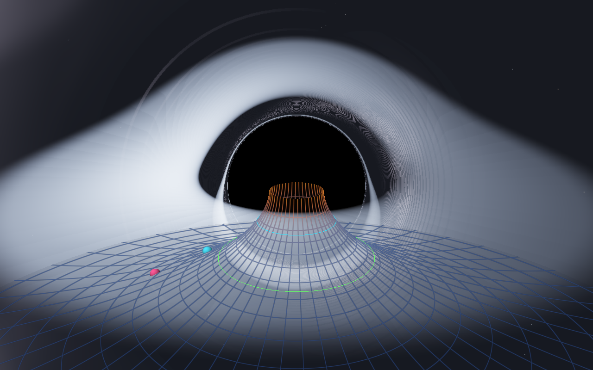

# Black Hole — Realtime Geodesic Ray Tracer (C++ / Metal)

A scientifically accurate, GPU-accelerated 3D simulation of a **Schwarzschild
(non-rotating) black hole**, written from scratch in C++ / Objective-C++ with
Metal compute shaders. Opens a native window and runs in realtime
(~60 fps on Apple Silicon).



## Features

### 1. Ray tracing through curved spacetime (gravitational lensing)
Every pixel traces one photon through the exact Schwarzschild geometry.
Null geodesics are integrated with the relativistic **Binet equation**
(u = 1/r as a function of orbital-plane angle φ):

```
d²u/dφ² = (3/2) rs u² − u        (RK4, adaptive step size)
```

Light rays in Schwarzschild spacetime are planar, so each ray is integrated in
its orbital plane and reconstructed in 3D. Initial conditions use the camera's
local orthonormal tetrad at finite radius. This reproduces, with no fitted
parameters:

- the **shadow** at the critical impact parameter b_c = 3√3/2 rs ≈ 2.598 rs
  (measured within ~2 % of theory in automated tests),
- the **photon sphere** at r = 1.5 rs,
- gravitational lensing of the procedural starfield / Milky-Way sky
  (Einstein rings, duplicated stars, etc. emerge from the ODE),
- higher-order images of the disk (the **photon ring / halos**).

### 2. Accretion disk (ray-traced, with halos)
- Geometrically thin disk in the equatorial plane, inner edge at the
  **ISCO** (r = 6M = 3 rs).
- **Novikov–Thorne-style** flux profile F(r) ∝ x⁻³(1 − x⁻¹ᐟ²) with zero-torque
  inner boundary (peaks at r ≈ 1.36 r_ISCO), mapped to a blackbody color
  through T ∝ F¹ᐟ⁴.
- **Exact relativistic frequency shift** for circular geodesic emitters:
  with locally measured orbital speed v² = M/(r − 2M),

  ```
  g = √(1 − rs/r) √(1 − v²) / (1 − v k̂·t̂)
  ```

  combining gravitational redshift, transverse and longitudinal Doppler.
  Observed intensity gets Liouville's factor I_obs = g³ I_emit and the
  blackbody temperature shifts as T_obs = g·T — the approaching side of the
  disk is visibly brighter and bluer (relativistic beaming).
- Every disk-plane crossing along the geodesic is accumulated, so the direct
  image, the secondary image (far side of the disk lensed over the shadow),
  and higher-order photon-ring halos all appear naturally.

### 3. Spacetime curvature — the "trapdoor" grid
A 3D overlay of **Flamm's paraboloid**, the exact embedding diagram of the
Schwarzschild equatorial spatial slice:

```
z(r) = −2 √( rs (r − rs) )
```

- rendered as a translucent curved surface with procedurally drawn,
  antialiased grid lines (rings uniform in ln r, radial spokes),
- line color encodes the **Kretschmann curvature scalar** K = 12 rs²/r⁶
  (blue → orange as curvature grows toward the horizon),
- highlight rings mark the **photon sphere** (cyan, r = 1.5 rs) and the
  **ISCO** (green, r = 3 rs),
- three "marbles" ride circular timelike geodesics with the exact Keplerian
  angular frequency Ω = √(M/r³), rolling on the curved surface.

### 4. Realtime
Metal compute kernel, one thread per pixel, adaptive RK4 step size, early
exit on capture/escape, tunable resolution scale. ~60–70 fps on an M4 Max
at default quality.

## Build & run

No dependencies beyond the macOS system frameworks (Cocoa, Metal, QuartzCore):

```sh
./build.sh          # produces build/blackhole
./build/blackhole   # opens the simulation window
```

## Controls

| input   | action                                        |
|---------|-----------------------------------------------|
| drag    | orbit camera                                  |
| scroll  | zoom (4 – 60 rs)                              |
| `G`     | toggle spacetime grid                         |
| `D`     | toggle accretion disk                         |
| `K`     | toggle background sky                         |
| `B`     | toggle relativistic beaming                   |
| `N`     | ray-traced background / plain black           |
| `Space` | pause/resume auto-orbit                       |
| `1/2/3` | quality presets (steps / resolution scale)    |
| `P`     | save `screenshot.png`                         |
| `R`     | reset camera                                  |
| `Esc`   | quit                                          |

Environment overrides for scripting/tests: `BH_GRID BH_DISK BH_SKY BH_BEAM
BH_YAW BH_PITCH BH_DIST BH_STEPS BH_SCALE BH_BG BH_EXPOSURE BH_LOG_FPS
BH_SHOT_FRAMES BH_SHOT_PATH BH_EXIT_AFTER_SHOT`.

## Code layout

```
src/Shaders.metal   geodesic integrator, disk physics, sky, grid shaders
src/main.mm         window, input, realtime render thread
src/Renderer.mm     Metal setup, grid/marble meshes, frame encoding
src/Params.h        CPU<->GPU parameter struct
src/MathUtil.h      minimal 4x4 matrix helpers
tools/analyze.py    screenshot analysis used for physics verification
```

## Verification

Automated screenshot analysis (tools/analyze.py) confirmed:

- shadow radius 232 px vs. 227 px predicted from b_c = 3√3/2 rs at the
  test camera distance (~2 %, within measurement tolerance),
- pure-black shadow interior (no spurious light leakage),
- Doppler asymmetry: approaching limb measurably brighter than receding limb,
- marble sprites and grid rendering present,
- 58–70 fps at default quality (1500 RK4 steps/pixel cap, 0.75 render scale).

## Scope / limitations

- Schwarzschild (zero spin); no Kerr frame dragging.
- Disk is geometrically thin and optically thin (emission accumulated
  additively, no self-absorption).
- Background sky is treated as infinitely far away; its (uniform) gravitational
  blueshift at the finite camera radius is ignored.
