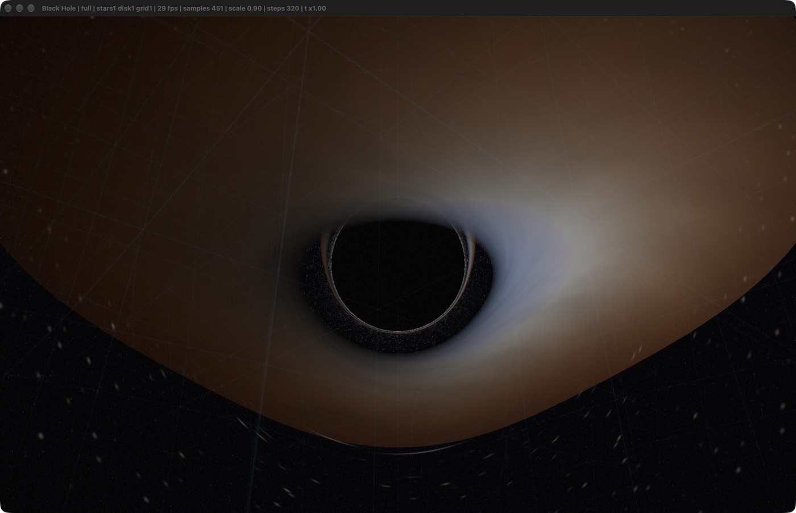
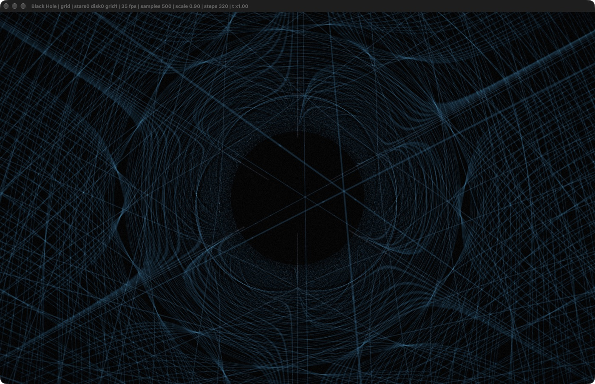
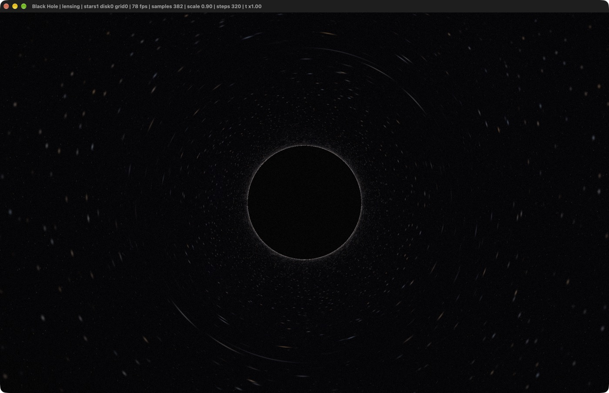
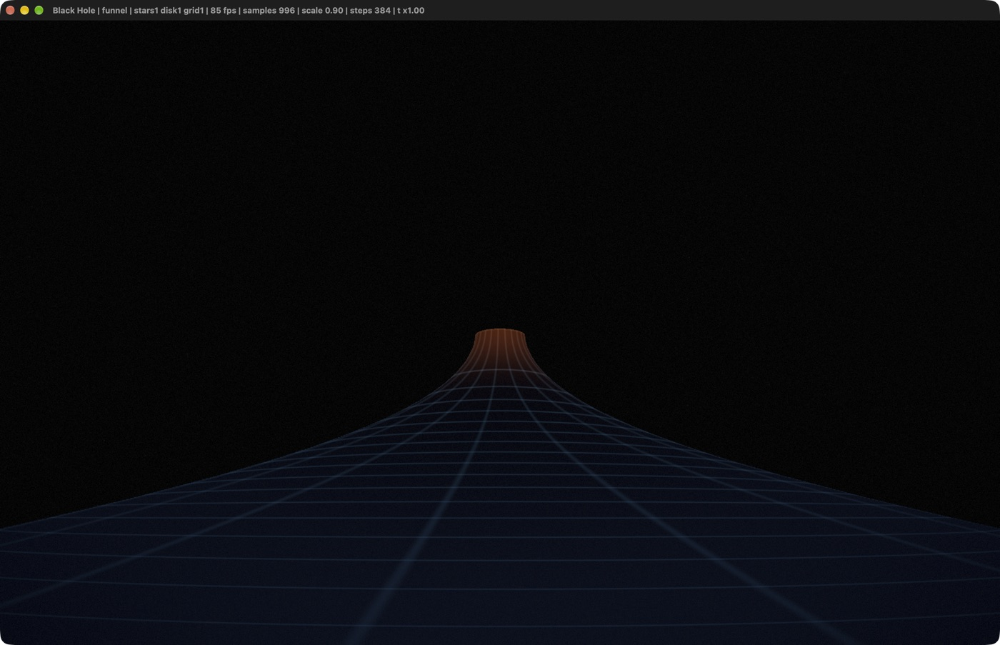

# Black Hole — Real-Time Schwarzschild Ray Tracer

A scientifically-grounded, fully GPU ray-traced black hole simulation. Every
pixel is a **null geodesic of the Schwarzschild spacetime** integrated backwards
in time from the camera, so gravitational lensing, the black-hole shadow, the
photon ring, and the Einstein-ring distortion of the sky are *simulated*, not
faked. Runs in real time in a native macOS window (OpenGL 4.1 core on Apple
Metal).

```
┌──────────────────────────────────────────────────────────────────────┐
│  mouse drag  orbit      wheel  zoom        keys: 1 2 3 4  scenes      │
│  J L I K  orbit   U O  zoom   S D G  layers   space pause  R reset    │
└──────────────────────────────────────────────────────────────────────┘
```

---

## Scenes (captured live from the simulator)

**1 · Full** — lensed accretion disk, photon ring, spacetime grid, starfield



**2 · Spacetime grid** — the coordinate lattice falling through curved space
into the event horizon: the "trapdoor"



**3 · Gravitational lensing only** — pure sky; note the Einstein-ring smearing
of stars around the shadow



**4 · Flamm paraboloid** — the exact isometric embedding of the Schwarzschild
spatial slice



---

## Build & run

Requirements: macOS, Xcode command line tools, cmake, GLFW 3
(`brew install glfw cmake`).

```bash
./build.sh                 # configure + compile + run
```

or by hand:

```bash
cmake -S . -B build -DCMAKE_PREFIX_PATH=/opt/homebrew -DCMAKE_BUILD_TYPE=Release
cmake --build build -j
./build/black-hole --scene 0
```

A Cocoa window opens and the simulation starts immediately, real-time.
No shader or asset files are needed at runtime (they are embedded into the
binary at build time), but if the `shaders/` directory is found next to the
binary the simulator **hot-reloads** it whenever you edit a `.glsl`/`.frag`
file — edit the shader, and the running simulation recompiles within a second.

Useful flags (see `--help`):

```
--scene 0..3   full / spacetime grid / lensing only / Flamm funnel
--dist --pitch --yaw --fov       camera
--steps 64..640                  max geodesic integration steps
--scale 0.4..1.25                render scale
--exposure --bloom --timescale --grid
--single                         raw samples (no temporal accumulation)
--exit-seconds 30                run for 30 s then quit (for screenshots)
```

---

## What is simulated

### 1. Ray tracing in curved spacetime (gravitational lensing)

Units are geometrized: `G = c = 1`, lengths in Schwarzschild radii
(`RS = 1`, mass `M = 0.5`). For a Schwarzschild black hole, null geodesics in
Cartesian coordinates obey the exact second-order system

```
d²x/dλ² = -(3/2) · h² · x / r⁵ ,      h = x × dx/dλ ,   r = |x|
```

(derived from the geodesic equation Γ^i_μν u^μ u^ν; `h` is the conserved
specific angular momentum). The shader integrates this with **RK4** and an
adaptive step `dt ≈ 0.055·r` (small near the hole, fast far away), tracking

* capture by the horizon (`r ≤ RS`),
* capture from inside the photon sphere (`r < 1.5 RS` while infalling),
* escape to infinity (`r > 45 RS`, outgoing).

Every ray that escapes samples the procedural sky **in its final direction**,
which is exactly what produces gravitational lensing: the star field is
Einstein-ringed and multiply-imaged around the shadow.

The photon's conserved energy is computed from its initial conditions,

```
E² = |v|² − RS·h²/r³        ( = |v| as r → ∞ )
```

and is used for the relativistic colour shifts of the disk below. Rays with
`E² ≤ 0` are exactly the critical rays that asymptote onto the photon sphere;
they terminate black.

### 2. Accretion disk with halos / photon ring

The disk is geometrically thin, in the equatorial plane, between the ISCO
(`6M = 3 RS`) and `13 RS`, following the standard thin-disk solution:

* temperature  `T(r) = T_ISCO · (R_ISCO / r)^{3/4}`
* emitted flux `F(r) ∝ (1 − √(R_ISCO/r)) / r³` (zero-torque inner boundary;
  the exponent is softened to `r^-2` on screen so the outer disk stays visible)
* colour = blackbody RGB of `T`, then shifted by the relativistic factor

```
g = ν_obs/ν_emit = (p·u)_obs / (p·u)_emit = E / (E·u^t − p_φ·Ω)
Ω  = √(M/r³)  (Keplerian),   u^t = √((r+M)/(r−RS))
```

so the observed colour temperature is `T_obs = g·T` and the bolometric
intensity scales as `g⁴` (relativistic beaming) — the side of the disk
rotating toward the camera is visibly brighter and bluer, the far side dimmer
and redder, including the full time-dilation of the gravitational term.

"Halos": the renderer continues each ray after a disk crossing, so up to **8
equatorial crossings** accumulate. Rays that loop around near the photon sphere
therefore produce the infinite series of higher-order disk images that
concentrate into the thin bright **photon ring** hugging the shadow's edge —
real GR optics, not a post effect (a separate bloom pass only adds the
photographic halo/glow on top).

### 3. Spacetime curvature — the "trapdoor in spacetime"

Because the camera ray is itself a geodesic, the 3D coordinate lattice is
**lensed by the hole**: grid lines stream toward the event horizon, wrap around
the shadow multiple times, and rays that fall in terminate black, so the grid
appears to be swallowed by a dark trapdoor. Lines are tinted by the local
gravitational time-dilation `dτ/dt = √(1 − RS/r)` (blue → orange near the
throat), and cells are anti-aliased by their angular size on screen.

Scene 3 additionally draws the **Flamm paraboloid**

```
w(r) = 2·√(RS·(r − RS))
```

the exact isometric embedding of the Schwarzschild spatial slice — the classic
funnel/throat picture of curved space around a black hole.

### 4. Real-time

Everything runs in one fragment shader at up to ~2.6 MP per frame; when the
camera is still the simulator accumulates temporally (sub-pixel jitter +
exponential average → progressive AA and a clean image), and drops to one
sample per frame while you move. On an Apple M4 Max: ~30–80 fps at full
quality (see the window title for live fps and sample count).

---

## Controls

| input | action |
|---|---|
| drag / wheel | orbit / zoom (min radius 3.2 RS) |
| `1` `2` `3` `4` | scene: full / spacetime grid / lensing / funnel |
| `S` `D` `G` | toggle stars / disk / spacetime grid |
| `J` `L` `I` `K` `U` `O` | orbit (yaw/pitch), zoom |
| `↑` `↓` / `←` `→` | exposure / bloom strength |
| `[` `]` / `-` `=` | render scale / integration steps |
| `,` `.` | disk time scale |
| `space` | pause rotation |
| `R` / `H` / `F` | reset / help / fullscreen |
| `ESC`, `Q` | quit |

## Files

```
shaders/blackhole.frag   the physics: geodesic integrator, disk, grid, funnel
shaders/quad.vert        fullscreen triangle
shaders/brightpass.frag  bloom bright-pass (halo)
shaders/blur.frag        separable Gaussian blur
shaders/composite.frag   ACES filmic tonemap, vignette, dither, gamma
src/main.cpp             window, GL pipeline, camera, accumulation, hot reload
cmake/embed_shaders.cmake  bakes the .glsl sources into the binary
tools/winid.c            dev helper: window id for window-only screenshots
```

## Scope & honest limitations

* Schwarzschild only (uncharged, non-rotating). Kerr frame-dragging would need
  a different geodesic system.
* The disk is a thin-disk **emission model**, not a GRMHD radiative transfer
  simulation; it is optically thick with a blackbody spectrum and the correct
  redshift/beaming factors.
* The sky (stars/nebula) is procedural; only its *lensing* is physical.
* Numerically: fixed-structure RK4 with adaptive step, terminated by step
  budget; captured rays and escaped rays are exact, spiralling rays are cut off
  after `--steps` (increase for reference-quality stills).
